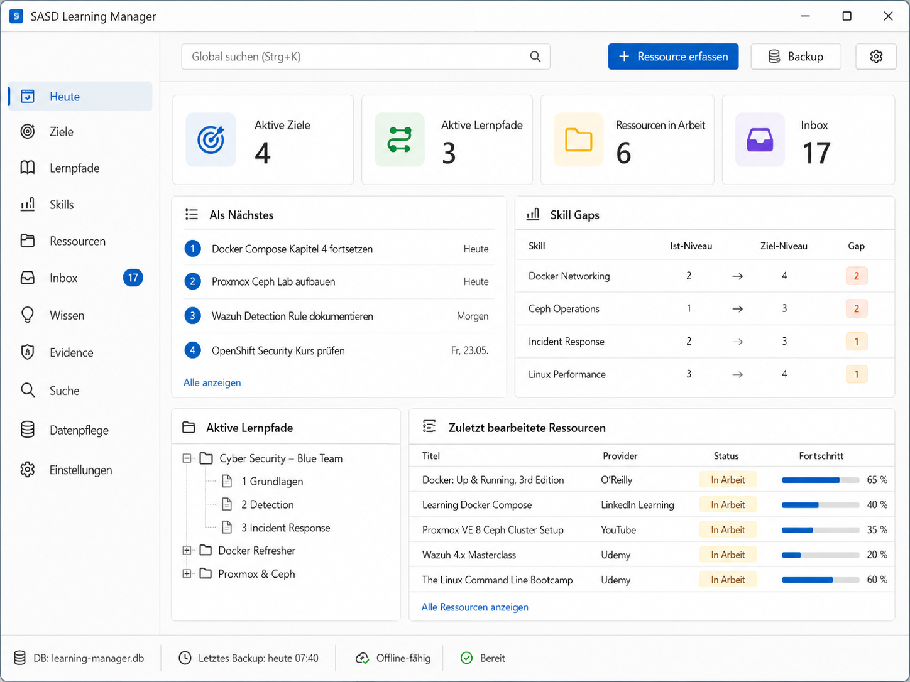

# SASD Learning Manager

> Persönlicher, anbieterunabhängiger Learning-Portfolio- und Competency-Manager für strukturierte Weiterbildung.

**Status:** Milestone 0 bis Milestone 5 Backend implementiert; Knowledge/Evidence WinForms noch offen  
**Stand:** 2026-09-02  
**Zielplattform:** Windows 11  
**Technologie:** C# / .NET 8 / Windows Forms / SQLite  
**Entwicklungsstandard:** SASD Development Standard

## GUI-Konzept



> Der Screenshot ist ein realistisches UI-Konzept für die geplante WinForms-Anwendung. Er ist eine visuelle Referenz, keine pixelgenaue Implementierungsvorgabe.

## Produktidee

Der SASD Learning Manager verbindet Lernziele, Kompetenzen und Skills mit strukturierten Learning Paths und beliebigen externen Lernressourcen. Er dokumentiert Lernfortschritt, Knowledge Artifacts, Evidence und Kompetenzentwicklung, ohne an einen einzelnen Kursanbieter gebunden zu sein.

```text
Goal
  ↓
Competency / Skill
  ↓
Learning Path
  ↓
Resource
  ↓
Learning Activity
  ↓
Knowledge / Evidence
  ↓
Skill Assessment
  ↓
Review / Retention
```

## Produktprinzipien

- **Skill before Course** – ein Kurs ist Lernmittel, nicht das Lernziel.
- **Canonical Resource** – eine Ressource wird einmal gepflegt und mehrfach referenziert.
- **Provider Neutral** – O’Reilly, LinkedIn Learning, YouTube, Udemy und andere Quellen sind gleichberechtigt.
- **Capture now, classify later** – neue Links landen schnell in der Inbox und werden später eingeordnet.
- **Completion ≠ Mastery ≠ Retention** – Abschluss, Kompetenzstand und Wissensaktualität sind getrennt.
- **Local first** – der fachliche Kern funktioniert offline und ohne verpflichtende Cloud.
- **Human in control** – spätere AI-Funktionen liefern Vorschläge, keine ungeprüften fachlichen Änderungen.

## V1-Kern

V1 soll ermöglichen:

1. Lernziel anlegen.
2. Skills und Ziel-Level definieren.
3. Learning Path strukturieren.
4. Ressourcen providerunabhängig erfassen.
5. Resources mehreren Skills und Paths zuordnen.
6. Fortschritt dokumentieren.
7. Knowledge und Evidence festhalten.
8. Skill neu bewerten.
9. Daten suchen, sichern und wiederherstellen.

Nicht V1: eigener PDF-/Video-Reader, Cloud Sync, Mehrbenutzerbetrieb, Provider-Login, AI als Kernabhängigkeit, vollständiges SRS oder öffentliche Community.

## Aktueller Implementierungsstand

### Verfügbar im WinForms-Client

- Providerverwaltung
- Ressourcenbibliothek mit Suche, Filtern und Paging
- Resource Editor mit Tags, URL, LocalPath, Progress, Status und Priorität
- Quick Capture (`Ctrl+Shift+N`) und Inbox
- URL-Normalisierung und Canonical-Resource-Dublettenerkennung
- Goals mit Skill-Zuordnung
- Competency Areas und Topics
- Skills mit Current-/Target-Level, Skill Gap und Assessment-Historie
- Learning Paths mit hierarchischen Nodes
- Required/Optional und Core Progress
- Node↔Skill- und Node↔Resource-Zuordnungen
- Node-Relationen und Zyklenschutz
- Ressourcen-Import/-Export als portable CSV über das Menü `Daten`

### M5 Backend vorhanden

Milestone 5 ergänzt die fachliche und persistente Basis für:

- Markdown-basierte Knowledge Artifacts
- Knowledge↔Resource/Skill/Topic/Goal/LearningPath
- Evidence mit Typ, Datum, URL/LocalPath und Evaluation
- Evidence↔Skill/Resource/Goal
- Archivieren/Wiederherstellen von Knowledge und Evidence
- Migration `0005_knowledge_evidence.sql`

Die dedizierten WinForms-Arbeitsbereiche **Wissen** und **Evidence** sind noch nicht implementiert und bleiben in der Navigation deaktiviert. Ebenfalls offen ist die direkte Evidence-Zuordnung zu einem einzelnen Skill Assessment. Evidence verändert Skill Mastery weiterhin ausdrücklich nicht automatisch.

### CSV-Import/-Export

Über das Menü:

```text
Daten
├── Ressourcen aus CSV importieren …
└── Ressourcen als CSV exportieren …
```

kann die Ressourcenbibliothek ohne direkte SQLite-Manipulation übertragen werden. Der Import verwendet die normalen Application Services, legt fehlende Provider kontrolliert an, respektiert URL-Dubletten und meldet fehlerhafte Zeilen einzeln.

Dokumentation: [`docs/user/RESOURCE-CSV-IMPORT-EXPORT.md`](docs/user/RESOURCE-CSV-IMPORT-EXPORT.md)

Chat-basierte Testdaten: [`testdata/import/resources-chat-recommendations.csv`](testdata/import/resources-chat-recommendations.csv)

## Repository-Struktur

```text
/
├── .github/
├── assets/
├── docs/
├── src/                  # Domain / Application / Infrastructure / WinForms
├── tests/                # Domain / Application / Infrastructure / Architecture Tests
├── testdata/             # portable Import-Testdaten
├── PROJECT-BRIEF.md
├── PROJECT-STATUS.md
├── ROADMAP.md
├── MILESTONES.md
└── GITHUB-SETUP.md
```

> Hinweis: Das Repository enthält aktuell noch versehentlich eingecheckte Dateien eines anderen SASD-Projekts (`SASD.Bewerbungsmanager`). Diese Altlast wird separat bereinigt und gehört nicht zur Learning-Manager-Solution.

## Dokumente

Siehe [`DOCUMENTATION-INDEX.md`](DOCUMENTATION-INDEX.md).

## Milestones

- **M0** – technische Baseline
- **M1** – Provider & Resource Library
- **M2** – Quick Capture & Inbox
- **M3** – Goals & Skills
- **M4** – Learning Paths
- **M5** – Knowledge & Evidence Backend; WinForms noch offen
- **nächster Produktschritt** – Knowledge/Evidence UI und direkte Assessment-Evidence-Zuordnung
- danach Dashboard/Search sowie Reliability/Backup/Restore

## Build und Tests

```powershell
dotnet restore .\SASD.LearningManager.sln
dotnet build .\SASD.LearningManager.sln -c Release --no-restore
dotnet test .\SASD.LearningManager.sln -c Release --no-build
```

Ziel: **0 Fehler, 0 Warnungen, alle Tests grün**.

Der Import/Export-Review-Branch wurde am 02.09.2026 in GitHub Actions auf Windows mit **0 Warnungen, 0 Fehlern und 73/73 grünen Tests** verifiziert. Details stehen in [`BUILD-VERIFY.md`](BUILD-VERIFY.md).

## Datenpfad

```text
%LOCALAPPDATA%\SASD\LearningManager\
├── data\learning-manager.db
├── logs\
├── backups\
└── settings.json
```

## GitHub-Repository

Die empfohlene Repository-Konfiguration, Topics und Branch-Protection-Hinweise stehen in [`GITHUB-SETUP.md`](GITHUB-SETUP.md).

Die Produktlizenz ist während der Implementierungs-/Pilotphase noch bewusst offen und wird vor einem öffentlichen Release entschieden.

## Entwicklungsstandard

<https://github.com/Robin-Goerlach/SASD-Development-Standard>

Die Dokumentation folgt dem Prinzip der progressiven Vertiefung: nur Artefakte erzeugen, die für Risiko, Wartbarkeit, Nachvollziehbarkeit oder reale Nachweise sinnvoll sind.
