# SASD Learning Manager – Architekturdokument

**Produkt:** SASD Learning Manager  
**Dokumenttyp:** Softwarearchitektur / Architecture Description  
**Version:** 0.1  
**Status:** Proposed / Architekturentwurf zur Prüfung  
**Stand:** 27. August 2026  
**Zielrelease:** V1 Core bis 1.0  
**Produktoberfläche:** Windows Forms  
**Technologie-Baseline:** C# / .NET 8 / Windows Forms / SQLite  
**Bezugsdokumente:**  
- `SASD-Learning-Manager-Lastenheft.md`
- `SASD-Learning-Manager-Pflichtenheft-WinForms.md`
- `SASD-Learning-Manager-Vorlagen-Funktionsanalyse.md`

**Normativer Projektbezug:** SASD Development Standard  
**Standard:** <https://github.com/Robin-Goerlach/SASD-Development-Standard>

---

# 1. Zweck, Status und Geltungsbereich

## 1.1 Zweck

Dieses Dokument beschreibt die Softwarearchitektur des **SASD Learning Manager** auf einem Detaillierungsgrad, der für Implementierung, Review, Wartung, Testplanung und spätere Erweiterungen ausreicht.

Es beantwortet insbesondere:

- Wo liegen die Systemgrenzen?
- Welche Architekturziele bestimmen das Design?
- Welche Komponenten und fachlichen Module existieren?
- Wer besitzt welche Daten und Geschäftsregeln?
- Welche Abhängigkeiten sind erlaubt bzw. verboten?
- Wie laufen zentrale Use Cases zur Laufzeit ab?
- Wie werden Daten gespeichert, migriert, gesichert und wiederhergestellt?
- Wo verlaufen Vertrauens- und Sicherheitsgrenzen?
- Wie werden externe Ressourcen und spätere Integrationen angebunden?
- Welche Architekturentscheidungen sind langfristig bindend?
- Wie wird überprüft, dass der implementierte Code der Architektur entspricht?

Das Dokument ist **preskriptiv** für V1: Es beschreibt die gewünschte Zielarchitektur. Spätere Abweichungen müssen bewusst entschieden und dokumentiert werden.

## 1.2 Status

| Feld | Wert |
|---|---|
| Architekturstatus | Proposed |
| Qualitätsstufe | für V1 Core auszuarbeiten und anschließend zu baselinen |
| Gültig für | SASD Learning Manager V1 |
| Architekturtyp | modularer Monolith / lokale Desktop-Anwendung |
| Hauptplattform | Windows 11 x64 |
| UI | WinForms |
| Persistenz | SQLite |
| Cloudpflicht | nein |
| primärer Betrieb | Single User, local-first |
| letzte Prüfung | 27.08.2026 |
| nächste Prüfung | vor Milestone 0 Coding Freeze |

## 1.3 Normativer Bezug zum SASD Development Standard

Das Architekturdokument orientiert sich an der aktuellen `ARCHITECTURE-TEMPLATE.md` des SASD Development Standard. Die dort verlangten Themen – Architekturziele und Constraints, Systemkontext, Komponenten, Datenflüsse, Daten und Persistenz, Laufzeit/Deployment, Sicherheit/Datenschutz, Architekturentscheidungen, Risiken und Verifikation – werden hier bewusst ausführlicher ausgearbeitet.

Zusätzlich berücksichtigt die Architektur die Desktop- und .NET-spezifischen Nachweispunkte des Standards:

- Technologie und Plattform,
- UI-Architektur,
- UX und Accessibility,
- Startup und Shutdown,
- Datenpfade und Migration,
- Packaging und Update,
- Testing und Support,
- reproduzierbarer Build,
- Security und Privacy.

## 1.4 Geltungsbereich

Dieses Dokument beschreibt den **lokalen Desktop-Kern** des SASD Learning Manager.

Enthalten:

- WinForms Client,
- Application Layer,
- Domain Layer,
- SQLite-Persistenz,
- lokale Datei-/URL-Referenzen,
- Such- und Planungslogik,
- Backup/Restore,
- Import/Export,
- Logging und Diagnose,
- optionale HTTP-Metadatenabfrage,
- definierte Erweiterungspunkte.

Nicht Gegenstand von V1:

- Cloud-Synchronisation,
- Mehrbenutzerbetrieb,
- Provider-Login,
- Provider-Progress-Import,
- Browser Extension,
- mobile App,
- eigener PDF-/Video-Reader,
- semantische Vektorsuche,
- AI-basierte Kompetenzbewertung,
- vollständiges Spaced-Repetition-System.

---

# 2. Architekturtreiber

## 2.1 Architekturziele

Die Architektur wird nicht primär von maximaler Skalierung, sondern von **Datenintegrität, Wartbarkeit, Verständlichkeit, Offline-Fähigkeit und langfristiger Erweiterbarkeit** getrieben.

Priorisierte Qualitätsziele:

1. **Datenintegrität**
2. **Wartbarkeit**
3. **Verständlichkeit**
4. **Bedienbarkeit**
5. **Datenschutz**
6. **Testbarkeit**
7. **Zuverlässigkeit**
8. **Performance**
9. **Erweiterbarkeit**
10. **Portabilität**

## 2.2 Qualitätsattribut-Szenarien

### QA-01 – Datenintegrität

**Auslöser:** Der Benutzer ordnet eine Ressource mehreren Learning Paths zu.  
**Erwartung:** Es existiert weiterhin genau ein kanonischer Resource-Datensatz; nur die Relationen werden ergänzt.  
**Messung:** Integrationstest weist eine Resource-ID und mehrere Join-Einträge nach.

### QA-02 – Offline-Fähigkeit

**Auslöser:** Das Netzwerk ist nicht verfügbar.  
**Erwartung:** Goals, Skills, Paths, Resources, Knowledge, Evidence, Suche und Backup funktionieren weiter.  
**Ausnahme:** Externe Links und Metadatenabruf sind nicht verfügbar, blockieren aber die lokale Anwendung nicht.

### QA-03 – Datenwiederherstellung

**Auslöser:** Ein Benutzer stellt ein zuvor erstelltes Backup wieder her.  
**Erwartung:** Entities, Relationen, Assessments und Historie entsprechen dem Sicherungsstand.  
**Messung:** automatisierter Backup-/Restore-Integrationstest.

### QA-04 – Wartbarkeit

**Auslöser:** Ein Entwickler ergänzt später einen Provider-Adapter.  
**Erwartung:** Domain und bestehende fachliche Module müssen dafür nicht von konkretem Provider-Code abhängig gemacht werden.

### QA-05 – UI-Responsiveness

**Auslöser:** Benutzer öffnet eine Ressourcenliste bei mehreren tausend Ressourcen.  
**Erwartung:** UI lädt eine paginierte Projektion und bleibt interaktiv.

### QA-06 – Security

**Auslöser:** Importdatei oder URL enthält manipulierte Daten.  
**Erwartung:** Daten werden als Daten behandelt; keine SQL-Injection, Codeausführung oder Pfadüberschreitung.

### QA-07 – Nachvollziehbarkeit

**Auslöser:** Eine Ressource wird abgeschlossen.  
**Erwartung:** Skill Mastery verändert sich nicht automatisch. Der Unterschied zwischen Completion und Mastery bleibt im Datenmodell und im UI sichtbar.

## 2.3 Architektur-Constraints

| ID | Constraint | Architekturauswirkung |
|---|---|---|
| ARC-CON-001 | Windows Desktop V1 | WinForms als primäre UI |
| ARC-CON-002 | .NET 8 | gemeinsame Runtime und Toolchain |
| ARC-CON-003 | Local-first | SQLite als lokale Source of Truth |
| ARC-CON-004 | Single User | keine Server-/Mandantenarchitektur |
| ARC-CON-005 | Offline Core | externe Dienste sind optionale Adapter |
| ARC-CON-006 | keine Provider-Credentials V1 | Links statt Accountintegration |
| ARC-CON-007 | Datenportabilität | offene Exportformate |
| ARC-CON-008 | SASD Development Standard | Traceability, Tests, ADRs, Security-Nachweise |
| ARC-CON-009 | überschaubare Dependency-Landschaft | Bordmittel und etablierte Libraries bevorzugt |
| ARC-CON-010 | keine Cloudpflicht | Deployment bleibt Desktop-zentriert |

---

# 3. Architekturprinzipien

## AP-01 – Domain Rules sind UI-unabhängig

Keine fachliche Regel darf ausschließlich in einem Button-Click-Handler existieren.

## AP-02 – Application Layer orchestriert Use Cases

Die UI ruft Use Cases auf. Repositories und Infrastruktur werden nicht direkt aus Forms angesprochen.

## AP-03 – Infrastructure ist Adapter

SQLite, Dateisystem, HTTP, Logging und Backup sind technische Adapter, nicht Träger fachlicher Wahrheit.

## AP-04 – Kanonische Identität

Fachliche Objekte besitzen stabile IDs. Beziehungen ersetzen Duplikation.

## AP-05 – Read Model darf optimiert sein

Für Listen, Dashboard und Suche dürfen spezialisierte SQL-Projektionen verwendet werden. Das Schreiben bleibt fachlich kontrolliert.

## AP-06 – Archive over Delete

Historisch relevante Objekte werden archiviert. Hard Delete ist Wartungsfunktion.

## AP-07 – Optionales Netzwerk

Die Anwendung darf ohne Netzwerk starten und lokal voll arbeiten.

## AP-08 – Human-in-the-loop für spätere AI

AI darf Vorschläge erzeugen, aber Kernzustände nicht ungefragt verändern.

## AP-09 – Progressive Complexity

Ein Benutzer kann mit Goals, Skills, Paths und Resources arbeiten, ohne jedes fortgeschrittene Feld zu pflegen.

## AP-10 – Bewusster modularer Monolith

Keine Microservices, kein Message Broker, keine verteilten Transaktionen, solange die Problemstellung dies nicht erfordert.

---

# 4. Systemkontext

## 4.1 Systemgrenze

Der SASD Learning Manager ist eine lokale Windows-Anwendung. Er verwaltet **Metadaten, Beziehungen, Fortschritt, Wissen und Nachweise**. Die eigentlichen Kursplattformen und die meisten Originalinhalte verbleiben außerhalb der Systemgrenze.

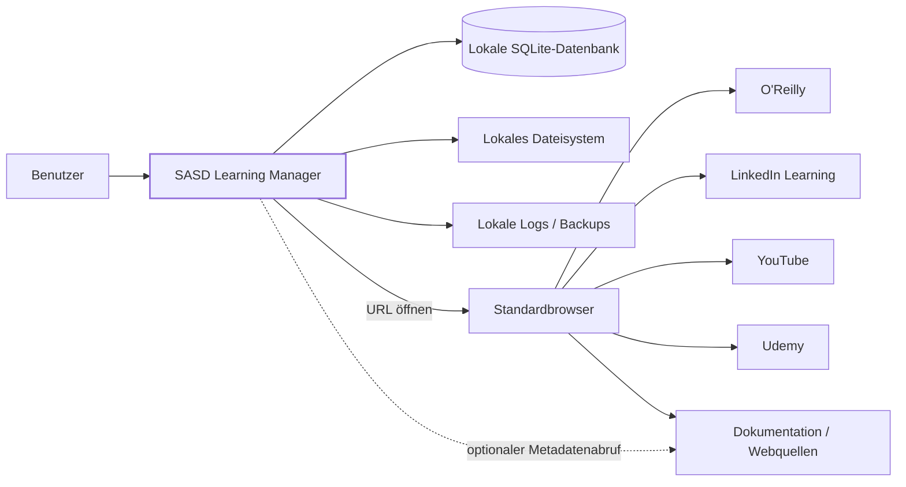

## 4.2 Akteure

### Primärer Akteur

**Lernender / Benutzer**

führt aus:

- Ziele definieren,
- Skills bewerten,
- Lernpfade erstellen,
- Ressourcen erfassen,
- Fortschritt pflegen,
- Evidence dokumentieren,
- Wissen notieren,
- Backup und Restore.

### Sekundäre technische Akteure

- Windows-Betriebssystem,
- Standardbrowser,
- lokales Dateisystem,
- externe Webseiten/Provider,
- GitHub nur für Entwicklung/Distribution, nicht für den Laufzeitkern.

## 4.3 Externe Systeme

| Systemtyp | Rolle | Vertrauensniveau |
|---|---|---|
| Standardbrowser | öffnet externe Lernressourcen | lokal vertrauenswürdig, Zielseiten nicht |
| O’Reilly/LinkedIn/YouTube/Udemy | externe Content-Provider | außerhalb Systemgrenze |
| beliebige Website | Lernquelle/Metadatenquelle | nicht vertrauenswürdig |
| lokales Dateisystem | Referenz auf PDFs, Bücher, Evidence | Benutzerkontext |
| Backup-Datei | Wiederherstellung | nur bei vertrauenswürdiger Herkunft |

## 4.4 Vertrauensgrenzen

```text
┌──────────────── Windows-Benutzerkontext ────────────────┐
│                                                         │
│   SASD Learning Manager                                 │
│      │                                                  │
│      ├── SQLite                                         │
│      ├── Settings                                       │
│      ├── Logs                                           │
│      └── Backups                                        │
│                                                         │
└──────────────────────┬──────────────────────────────────┘
                       │ Trust Boundary
                       ▼
                 externe Inhalte
          URLs / HTML / Downloads / Webseiten
```

Alles, was über URL, Import oder Backup in die Anwendung gelangt, wird als **untrusted input** behandelt.

---

# 5. Architekturüberblick

## 5.1 Stil

Die Anwendung wird als **modularer, geschichteter Monolith** implementiert.

Vier primäre Assemblies:

```text
SASD.LearningManager.WinForms
SASD.LearningManager.Application
SASD.LearningManager.Domain
SASD.LearningManager.Infrastructure
```

## 5.2 Hauptabhängigkeiten

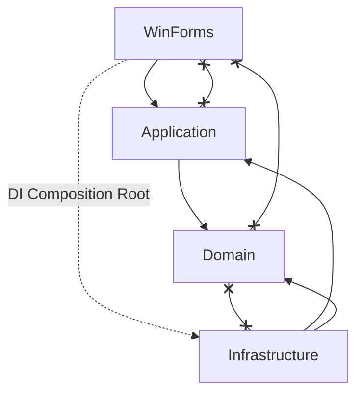

Interpretation:

- **Domain** kennt keine UI und keine SQLite-Technik.
- **Application** kennt Domain und abstrahiert benötigte Ports.
- **Infrastructure** implementiert Ports aus Application.
- **WinForms** konsumiert Application Use Cases.
- Der Composition Root verbindet zur Laufzeit Application und Infrastructure.

## 5.3 Warum kein klassisches „Clean Architecture“-Ringmodell mit vielen Projekten?

Das System übernimmt die **wichtigen Dependency-Regeln**, vermeidet aber künstliche Projektvermehrung.

Für V1 genügen vier Assemblies, weil:

- Single-User Desktop,
- ein Deployment,
- eine Datenbank,
- keine verteilten Dienste,
- kleine Entwicklungsorganisation,
- geringe operative Komplexität.

Zusätzliche Assemblies entstehen nur, wenn ein klarer technischer oder organisatorischer Nutzen nachgewiesen ist.

---

# 6. Fachliche Modulstruktur

Die Schichten sind technisch. Innerhalb von Domain und Application wird zusätzlich **fachlich modularisiert**.

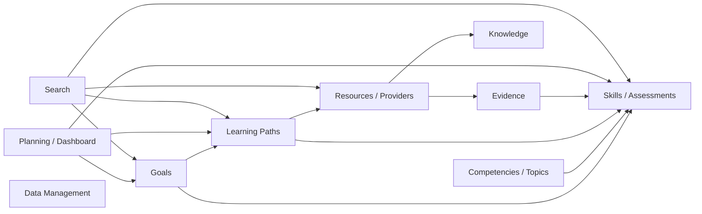

## 6.1 Modul Goals

Verantwortung:

- Lernziele,
- Zieltypen,
- Priorität,
- Status,
- Motivation,
- Zieltermine,
- Zuordnung zu Skills und Paths.

Besitzt nicht:

- Skill Mastery,
- Path-Nodes,
- Resource-Fortschritt.

## 6.2 Modul Competencies / Topics

Verantwortung:

- grobe Kompetenzbereiche,
- thematische Struktur,
- Topic-Hierarchie/Relationen.

Ein Competency Area wird **nicht selbst gemastert**. Mastery gehört zu Skills.

## 6.3 Modul Skills

Verantwortung:

- bewertbare Fähigkeiten,
- Ziel-Level,
- Skill Assessments,
- Skill Gap,
- Review-/Recency-Daten.

Fachliche Kernregel:

> Completion externer Ressourcen darf den Skill-Level nicht autonom setzen.

## 6.4 Modul Learning Paths

Verantwortung:

- Pfade,
- hierarchische Nodes,
- Required/Optional,
- Reihenfolge,
- Node-Status,
- Prerequisites/Alternativen,
- Zuordnung von Skills und Resources,
- Pfadfortschritt.

## 6.5 Modul Resources

Verantwortung:

- kanonische Lernressource,
- Provider,
- Typ,
- URL/LocalPath,
- Status/Progress,
- Tags,
- Resource-to-Resource-Relationen,
- Inbox/Capture.

## 6.6 Modul Knowledge

Verantwortung:

- Knowledge Artifacts,
- Markdown-Inhalt,
- Verknüpfung zu Resources, Skills, Topics, Goals und Paths.

Nicht verantwortlich für:

- vollständigen PDF-Reader,
- WYSIWYG-Notizsystem,
- Spaced Repetition.

## 6.7 Modul Evidence

Verantwortung:

- Nachweisobjekte,
- Evidence-Typ,
- URL/Dateireferenz,
- Skill-Zuordnung,
- optional Goal/Resource-Zuordnung.

## 6.8 Modul Planning / Dashboard

Verantwortung:

- Dashboard-Aggregate,
- Next Actions,
- „Als Nächstes“-Sortierung,
- überfällige/aktuelle Aufgaben im Lernkontext.

Es ist **kein allgemeiner Task Manager**.

## 6.9 Modul Search

Verantwortung:

- globale Suche,
- gefilterte Ressourcenlisten,
- später Saved Views/FTS.

Search besitzt keine fachlichen Entities; es liefert Projektionen.

## 6.10 Modul Data Management

Verantwortung:

- Backup,
- Restore,
- Import,
- Export,
- Datenpflege,
- Integrity Check,
- Migrationen,
- Diagnose.

---

# 7. Komponenten und Verantwortlichkeiten

| Komponente | Verantwortung | Eingaben | Ausgaben | Abhängigkeiten |
|---|---|---|---|---|
| `MainForm` | Shell, Navigation, Status | UI-Ereignisse | aktive View | Navigation |
| Views | Darstellung fachlicher Arbeitsbereiche | DTOs | Commands/Queries | Application |
| Presentation Services | UI-State/Mapping | Application DTOs | View State | Application |
| Application Services | Use-Case-Orchestrierung | Commands | Results/DTOs | Domain, Ports |
| Domain Entities | Invarianten/Fachzustand | fachliche Operationen | neuer Zustand/Domainfehler | keine Technik |
| Domain Services | fachliche Regeln über mehrere Objekte | Domainobjekte | fachliches Ergebnis | Domain |
| Repository Ports | Persistenz-Abstraktion | IDs/Entities/Queries | Entities/Projections | Application |
| SQLite Repositories | konkrete Persistenz | SQL/Parameters | Records | SQLite |
| Query Services | optimierte Read Models | Filter | DTO-Listen | SQLite |
| Migration Runner | DB-Schema-Versionierung | Migrationen | aktuelles Schema | SQLite |
| Backup Service | konsistente Sicherung | DB/Settings | Backup ZIP | Filesystem/SQLite |
| Restore Service | validierte Wiederherstellung | Backup ZIP | restaurierte DB | Filesystem/SQLite |
| Export Service | Portabilität | Domain/Queries | JSON/CSV/MD | Filesystem |
| Import Service | kontrollierte Übernahme | Importfile | Staging/Entities | Validation/DB |
| Metadata Service | optionale URL-Metadaten | URI | MetadataResult | HTTP |
| Logging | Diagnose | strukturierte Events | Logdateien | Filesystem |

---

# 8. Projekt- und Namespace-Struktur

## 8.1 Repository

```text
/
├── .github/
│   └── workflows/
├── docs/
│   ├── requirements/
│   ├── architecture/
│   ├── decisions/
│   ├── security/
│   ├── testing/
│   ├── operations/
│   └── user/
├── src/
│   ├── SASD.LearningManager.Domain/
│   ├── SASD.LearningManager.Application/
│   ├── SASD.LearningManager.Infrastructure/
│   └── SASD.LearningManager.WinForms/
├── tests/
│   ├── SASD.LearningManager.Domain.Tests/
│   ├── SASD.LearningManager.Application.Tests/
│   ├── SASD.LearningManager.Infrastructure.Tests/
│   └── SASD.LearningManager.Architecture.Tests/
├── .editorconfig
├── CHANGELOG.md
├── LICENSE
├── README.md
└── SASD.LearningManager.sln
```

## 8.2 Domain

```text
Domain/
├── Goals/
├── Competencies/
├── Skills/
├── LearningNeeds/
├── LearningPaths/
├── Resources/
├── Providers/
├── Knowledge/
├── Evidence/
├── Tags/
├── Relations/
└── Common/
```

## 8.3 Application

```text
Application/
├── Goals/
├── Skills/
├── LearningPaths/
├── Resources/
├── Knowledge/
├── Evidence/
├── Planning/
├── Search/
├── DataManagement/
└── Abstractions/
```

Jedes fachliche Verzeichnis darf wiederum enthalten:

```text
Commands/
Queries/
Dtos/
Services/
Validators/
```

ohne ein Framework dafür zu erzwingen.

## 8.4 Infrastructure

```text
Infrastructure/
├── Persistence/
│   ├── Repositories/
│   ├── Queries/
│   ├── Migrations/
│   └── Mapping/
├── Backup/
├── ImportExport/
├── Files/
├── Web/
├── Logging/
└── Configuration/
```

## 8.5 WinForms

```text
WinForms/
├── Forms/
├── Views/
├── Dialogs/
├── Controls/
├── Navigation/
├── Presentation/
└── Resources/
```


# 9. Logische Architektur und Domain-Modell

## 9.1 Aggregate und Ownership

Die Architektur vermeidet ein einziges gigantisches Objektmodell. Fachliche Zustände werden in überschaubare Aggregate getrennt.

### Aggregate Root: Goal

Besitzt:

- Goal-Identität,
- Typ,
- Status,
- Priorität,
- Motivation,
- Zieltermin,
- Next Action.

Referenziert über IDs/Relationen:

- Skills,
- Learning Paths.

Ein Goal besitzt **nicht** die Skills oder Paths als eingebettete Objekte.

### Aggregate Root: Skill

Besitzt:

- Skill-Identität,
- Name/Beschreibung,
- aktuelles und Ziel-Level,
- Review-/Recency-Felder,
- Status.

Skill Assessments bilden eine eigene Historie mit Bezug auf Skill.

### Aggregate Root: LearningPath

Besitzt:

- Path-Metadaten,
- Status/Priorität,
- Termine,
- Path Nodes.

`LearningPathNode` gehört strukturell zu genau einem Learning Path und ist Teil dessen hierarchischer Struktur.

### Aggregate Root: Resource

Besitzt:

- kanonische Identität,
- Titel/Typ,
- Providerbezug,
- URL/LocalPath,
- Metadaten,
- Lernstatus,
- Progress,
- Priorität,
- Termine.

Zuordnungen zu Skills/Topics/Path Nodes sind separate Relationen.

### Aggregate Root: KnowledgeArtifact

Besitzt:

- Typ,
- Titel,
- Markdown-Inhalt,
- Lifecycle.

### Aggregate Root: Evidence

Besitzt:

- Nachweistyp,
- Beschreibung,
- Datum,
- URL/LocalPath,
- optionale Bewertung.

## 9.2 Warum keine riesigen Objektgraphen?

Ein Resource-Detail könnte theoretisch Goals → Paths → Nodes → Skills → Assessments → Evidence laden. Das wird bewusst vermieden.

Stattdessen:

- Entities bleiben fokussiert,
- Relations werden über IDs verwaltet,
- Detailansichten laden benötigte Read Models,
- Commands verändern gezielt fachliche Aggregate.

Das reduziert:

- unkontrollierte Lazy-Loading-Probleme,
- große Speichergraphen,
- versehentliche Mehrfachupdates,
- unnötige Datenbankzugriffe.

## 9.3 Kerndomänenbeziehungen

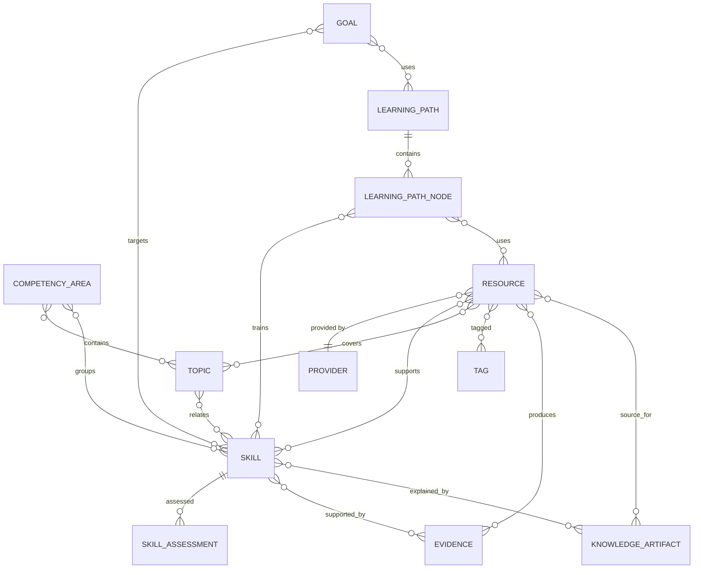

## 9.4 Topic vs. Skill

Diese Trennung bleibt architektonisch bewusst erhalten.

**Topic**
- klassifiziert Wissen,
- ist thematisch,
- muss nicht bewertbar sein.

**Skill**
- beschreibt anwendbare Fähigkeit,
- besitzt Current/Target Level,
- besitzt Assessments und Evidence.

Beispiel:

```text
Competency Area:
  Linux Administration

Topic:
  systemd

Skills:
  systemd Units erstellen und ändern
  fehlgeschlagene Services diagnostizieren
  Boot-Abhängigkeiten analysieren
```

Dadurch bleibt die Anwendung sowohl als Wissensstruktur als auch als Kompetenzmanager sinnvoll.

---

# 10. Dependency Rules

## 10.1 Assembly-Matrix

| Von \ Nach | Domain | Application | Infrastructure | WinForms |
|---|---:|---:|---:|---:|
| Domain | ✓ | ✗ | ✗ | ✗ |
| Application | ✓ | ✓ | ✗ | ✗ |
| Infrastructure | ✓ | ✓ | ✓ | ✗ |
| WinForms | indirekt/DTO | ✓ | nur Composition Root | ✓ |

## 10.2 Domain

Erlaubt:

- .NET BCL,
- fachlich neutrale kleine Basistypen.

Nicht erlaubt:

- `Microsoft.Data.Sqlite`,
- `System.Windows.Forms`,
- HTTP Clients,
- Dateisystemzugriff,
- Logger-Abhängigkeit für fachliche Regeln,
- konkrete externe Provider.

## 10.3 Application

Erlaubt:

- Domain,
- Ports/Interfaces,
- DTOs,
- `CancellationToken`,
- Logging-Abstraktion in orchestrierenden Services soweit sinnvoll.

Nicht erlaubt:

- SQL,
- WinForms Controls,
- konkrete Dateipfade,
- konkrete Provider-URLs als Kernlogik.

## 10.4 Infrastructure

Implementiert:

- Repository Ports,
- HTTP Ports,
- Backup Ports,
- Export Ports,
- Filesystem Ports.

Infrastructure darf fachliche Regeln nicht neu erfinden. Wenn eine Regel sowohl UI als auch Import betrifft, gehört sie in Domain/Application.

## 10.5 WinForms

WinForms darf:

- Commands aufbauen,
- Queries ausführen,
- DTOs anzeigen,
- Eingaben vorvalidieren,
- Fehler visualisieren.

WinForms darf nicht:

- DB-Transaktionen koordinieren,
- SQL ausführen,
- Skill Gap selbst berechnen,
- Path-Zyklen selbst als einzige Schutzschicht verhindern,
- Backupdateien direkt zusammensetzen.

---

# 11. Application Architecture

## 11.1 Use-Case-orientiertes Application Design

Application Code wird nach Use Cases und Fachmodulen strukturiert.

Beispiel `Resources`:

```text
Resources/
├── Commands/
│   ├── CreateResource/
│   ├── CaptureResource/
│   ├── UpdateResource/
│   ├── ChangeResourceStatus/
│   ├── UpdateResourceProgress/
│   ├── ArchiveResource/
│   ├── AssignResourceToSkill/
│   └── AddResourceRelation/
├── Queries/
│   ├── GetResourceDetail/
│   ├── SearchResources/
│   └── GetInbox/
└── Dtos/
```

Das ist eine leichte „Vertical Slice“-Organisation **innerhalb** der geschichteten Architektur.

## 11.2 Commands

Commands verändern Zustand.

Beispiel:

```csharp
public sealed record CaptureResourceCommand(
    string? Url,
    string? Title,
    string? Note);
```

Handler/Application Service:

1. validiert,
2. normalisiert URL,
3. prüft mögliche Dublette,
4. erzeugt Resource,
5. speichert über Repository,
6. schreibt ActivityLog,
7. liefert Result.

## 11.3 Queries

Queries liefern Read Models und dürfen auf Performance optimiert sein.

Beispiel:

```csharp
public sealed record ResourceListItemDto(
    Guid Id,
    string Title,
    string? ProviderName,
    ResourceType Type,
    ResourceStatus Status,
    int? ProgressPercent,
    ResourcePriority Priority);
```

## 11.4 Kein CQRS-Framework

Es wird semantisch zwischen Commands und Queries getrennt, aber kein schweres CQRS-/Mediator-Framework benötigt.

Gründe:

- kleiner Desktop-Monolith,
- einfaches Debugging,
- weniger indirekte Kontrolle,
- kleine Dependency-Landschaft.

## 11.5 Result Pattern

Erwartbare fachliche Fehler sollen nicht als technische Ausnahme missbraucht werden.

Beispiel:

```csharp
Result<ResourceDto>
```

Fehlerkategorien:

- Validation,
- NotFound,
- Conflict,
- InvalidState,
- Duplicate,
- ExternalFailure.

Unerwartete technische Fehler bleiben Exceptions und werden an der Application Boundary behandelt.

---

# 12. Domain Services und fachliche Regeln

## 12.1 Wann Domain Service?

Eine Regel gehört in einen Domain Service, wenn:

- mehrere Entities beteiligt sind,
- sie nicht natürlich einer Entity gehört,
- sie unabhängig von Persistenz und UI ist.

Beispiele:

- Path-Fortschritt,
- Relationenkonsistenz,
- Statusübergangsregeln,
- Skill-Gap-Berechnung.

## 12.2 PathProgressCalculator

```text
Input:
- aktive Nodes,
- Required/Optional,
- Completion Status.

Output:
- RequiredCompleted
- RequiredTotal
- OptionalCompleted
- OptionalTotal
- CoreCompletionPercentage?
```

Regeln:

- archivierte Nodes werden nicht berücksichtigt,
- Optional-Nodes reduzieren Kernabschluss nicht,
- Ressourcenprozent ist separat.

## 12.3 ResourceRelationPolicy

Verhindert:

- Self Relation,
- duplicate symmetric relation,
- inkonsistente inverse gerichtete Relation.

## 12.4 PathHierarchyPolicy

Verhindert Zyklen bei Node-Moves.

## 12.5 ResourceCompletionPolicy

Ein Resource Completion Event kann:

- `CompletedAt` setzen,
- Progress 100 % vorschlagen,
- Evidence-Vorschlag ermöglichen.

Es darf **nicht**:

- Skill Mastery ändern,
- Goal automatisch abschließen,
- alle Path Nodes automatisch abschließen.

---

# 13. UI-Architektur

## 13.1 Shell

`MainForm` ist die langlebige Shell.

Es besitzt:

- Hauptnavigation,
- Content Host,
- globale Suche,
- StatusStrip,
- globale Commands wie Quick Capture.

## 13.2 Views

Hauptbereiche als `UserControl`:

```text
DashboardView
GoalsView
LearningPathsView
SkillsView
ResourcesView
InboxView
KnowledgeView
EvidenceView
SearchView
MaintenanceView
SettingsView
```

## 13.3 Detaildialoge

Komplexe Bearbeitung erfolgt in fokussierten Dialogen:

```text
GoalEditForm
SkillEditForm
SkillAssessmentForm
ResourceEditForm
EvidenceEditForm
KnowledgeArtifactEditForm
ProviderEditForm
```

Learning Path bleibt bevorzugt im Hauptarbeitsbereich, weil Baum und Detail gleichzeitig benötigt werden.

## 13.4 Presentation Logic

WinForms wird nicht mit vollem MVVM überzogen.

Empfohlen:

```text
View
 ↕
Presenter / Presentation Service
 ↕
Application
```

Ziel:

- Event Handler kurz,
- UI-Zustand testbar,
- Mapping zentral,
- keine SQL-/Domain-Magie im Form.

## 13.5 Navigation Service

Navigation erfolgt anhand fachlicher IDs, nicht über direkte Formreferenzen.

```csharp
public interface INavigationService
{
    void NavigateTo(AppPage page);
    void NavigateToResource(Guid resourceId);
    void NavigateToSkill(Guid skillId);
    void NavigateToLearningPath(Guid pathId);
}
```

## 13.6 Dirty State

Komplexe Editoren:

- markieren ungespeicherte Änderungen,
- Warnung beim Verlassen,
- speichern atomar über einen Use Case.

Listenstatusänderungen dürfen gezielt sofort persistiert werden.

---

# 14. UI-Datenfluss

## 14.1 Read Flow

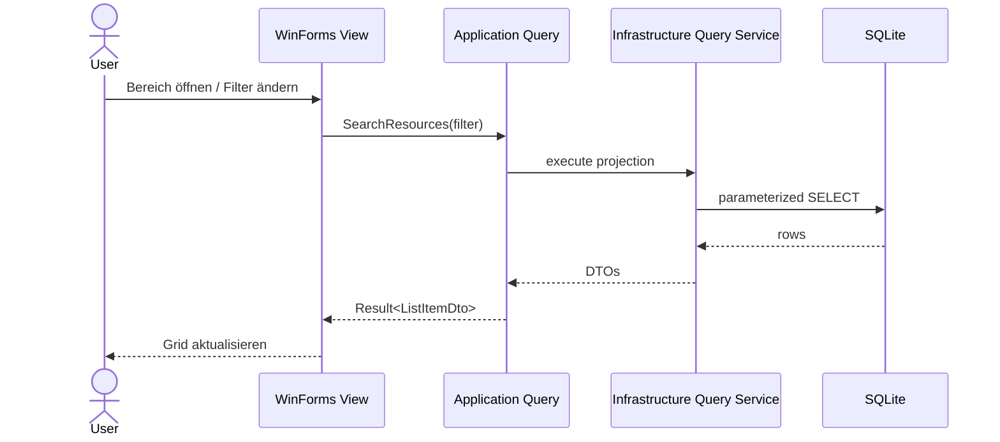

## 14.2 Write Flow

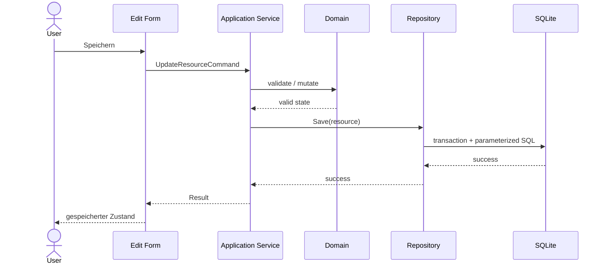

## 14.3 Warum keine direkte Entity-Bindung?

DataGridViews erhalten Projektionen, nicht lebende Domainobjekte.

Gründe:

- kontrollierte Datenmengen,
- kein versehentliches Auto-Save,
- klare Write Boundary,
- weniger UI-Kopplung.

---

# 15. Quick-Capture-Architektur

## 15.1 Ziel

Capture muss auch funktionieren, wenn:

- kein Netzwerk,
- Metadatenservice ausfällt,
- Provider unbekannt,
- Skill unbekannt.

## 15.2 Sequenz

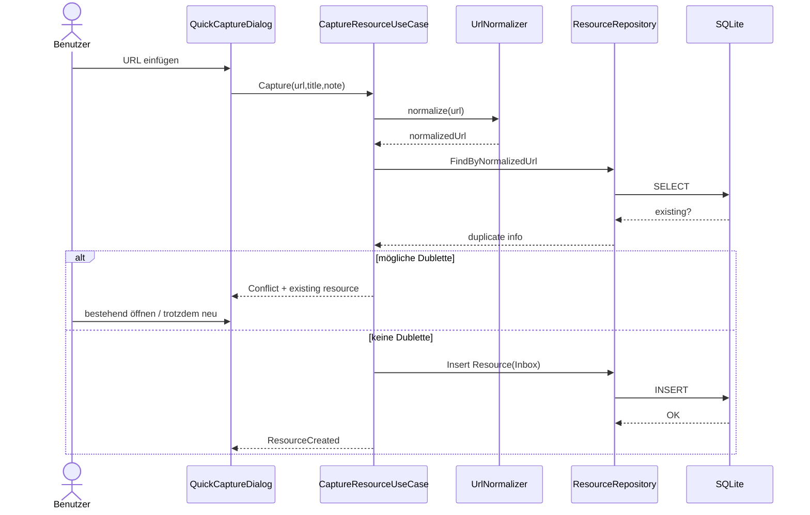

## 15.3 Optionaler Metadatenabruf

Der Metadatenabruf wird als **nachgelagerter Komfortschritt** betrachtet.

Er darf:

- Titel vorschlagen,
- Beschreibung vorschlagen,
- Site Name erkennen.

Er darf nicht:

- Save blockieren,
- ungefragt JavaScript ausführen,
- Provider-Login durchführen,
- Daten still überschreiben.

---

# 16. Learning-Path-Architektur

## 16.1 Tree als primäres Modell

Learning Path Nodes bilden einen **Adjacency List Tree**:

```text
Id
LearningPathId
ParentNodeId?
SortOrder
```

Vorteile:

- SQLite-freundlich,
- einfach zu verstehen,
- flexibel verschachtelbar,
- TreeView-kompatibel.

## 16.2 Rekursion

V1-Anzahl Nodes pro Path bleibt moderat.

Operationen:

- Baum laden,
- Descendants ermitteln,
- zyklische Moves verhindern.

SQLite Recursive CTE darf für Descendant Queries verwendet werden.

## 16.3 Node-Move

Node Move ist ein Application Use Case:

1. Source laden,
2. Target Parent prüfen,
3. Zyklusprüfung,
4. neue SortOrder bestimmen,
5. Geschwister neu ordnen,
6. Transaktion committen.

## 16.4 Path Relations

Prerequisites und Alternativen werden **nicht** über Tree Parent/Child modelliert, sondern als separate Graphrelationen.

Damit bleiben:

- Hierarchie = Struktur,
- Relation = fachliche Abhängigkeit.

---

# 17. Skill-Assessment-Architektur

## 17.1 Append-oriented History

Skill Assessments werden als neue Datensätze ergänzt.

```text
Skill
  └── Assessment 2026-05-01: 2
  └── Assessment 2026-08-27: 3
```

Vorteile:

- Historie,
- nachvollziehbare Entwicklung,
- Evidencebezug,
- keine Überschreibung früherer Selbsteinschätzung.

## 17.2 Current Level

Architekturvarianten:

**A – berechnen**
- neuestes Assessment per Query.

**B – zusätzlich cachen**
- `Skills.CurrentLevel`.

V1 darf B verwenden, wenn jede Assessment-Transaktion den Cache konsistent aktualisiert.

Regel:

> Assessment History ist fachliche Quelle; CurrentLevel ist gegebenenfalls optimierter aktueller Snapshot.

## 17.3 Evidencebezug

Evidence kann mehreren Assessments indirekt über Skill dienen. Wenn konkrete Evidence pro Assessment wichtig wird, kann V1.x eine `SkillAssessmentEvidence`-Join-Tabelle ergänzen.

---

# 18. Search Architecture

## 18.1 V1

Klassische lokale Suche mit:

- SQL,
- `LIKE`,
- normalisierten Filtern,
- Indizes,
- Pagination.

## 18.2 Query Model

Search Queries arbeiten mit dedizierten Filterrecords.

Kein In-Memory-Filtern über kompletten Bestand.

## 18.3 V1.x FTS5

FTS5 wird erst eingeführt, wenn:

- Messungen die Notwendigkeit zeigen,
- Migration sauber planbar ist.

FTS darf klassische strukturierte Filter nicht ersetzen.

## 18.4 Future Semantic Search

Semantische Suche ist ein eigener Adapter/Index und kein Grundbestandteil des Domain Models.

Die Source of Truth bleibt die relationale DB.

---

# 19. Planning- und Dashboard-Architektur

## 19.1 Read Model

Dashboard ist ein **Read Model**, kein eigenes Aggregate.

Datenquellen:

- aktive Goals,
- aktive Paths,
- Started Resources,
- Inbox Count,
- Skill Gaps,
- Next Actions.

## 19.2 Priorisierung „Als Nächstes“

V1 verwendet eine deterministische, erklärbare Sortierung.

Beispiel:

```text
1. überfällig
2. fällig in Kürze
3. explizit hohe Priorität
4. Next Action vorhanden
5. aktive Arbeit
6. letzte Änderung
```

Das Ergebnis kann im UI begründen:

```text
„fällig morgen“
„hohe Priorität“
„aktiver Learning Path“
```

Keine Black-Box-KI ist nötig.

---

# 20. Knowledge Architecture

## 20.1 Markdown als Source Format

`KnowledgeArtifact.ContentMarkdown` ist der fachliche Inhalt.

Gründe:

- offen,
- menschenlesbar,
- exportierbar,
- Obsidian-kompatibel,
- Git-/Diff-freundlich,
- kein proprietäres Rich-Text-Format.

## 20.2 Rendering

V1 benötigt keinen vollständigen Markdown Renderer.

Wenn später Preview:

- Renderer ist Presentation/Infrastructure-Abhängigkeit,
- Domain bleibt Markdown-String,
- Raw HTML wird deaktiviert oder sanitisiert.

## 20.3 Knowledge als eigenes Objekt

Eine Resource kann:

- mehrere Notes erzeugen,
- eine Summary,
- ein Cheat Sheet,
- eine Procedure.

Ein Knowledge Artifact kann auch mehrere Quellen zusammenfassen.

---

# 21. Evidence Architecture

## 21.1 Evidence ist nicht Attachment

Evidence ist ein **fachlicher Nachweis**.

Ein lokaler Pfad oder URL ist nur ein Beleg für die Evidence.

Beispiel:

```text
Evidence:
  "Proxmox Ceph Lab erfolgreich aufgebaut"

Type:
  Lab

LocalPath:
  C:\...\lab-notes.md
```

## 21.2 Keine automatische Vertrauensbewertung

V1 klassifiziert Evidence nicht automatisch als „stark/schwach“. Eine optionale persönliche Bewertung ist möglich.

---


# 22. Persistenzarchitektur

## 22.1 SQLite als lokale Source of Truth

Die SQLite-Datenbank ist die **autoritative lokale Persistenz** der fachlichen Anwendungsdaten.

Sie enthält:

- Goals,
- Competencies,
- Topics,
- Skills,
- Assessments,
- Learning Needs,
- Learning Paths/Nodes,
- Resources/Providers,
- Tags/Relationen,
- Knowledge,
- Evidence,
- Activity History.

Nicht zwingend enthalten:

- externe Original-PDFs,
- vollständige Webseiten,
- Provider-Videos,
- Browser-Cookies,
- Provider-Zugangsdaten.

## 22.2 Warum SQLite?

SQLite passt zur Zielarchitektur, weil:

- kein Server nötig,
- transaktional,
- robust,
- sehr gut für Single-User-Desktop,
- Backup gut beherrschbar,
- leicht verteilbar,
- ausreichend performant,
- relationale Integrität,
- FTS5 optional,
- gute .NET-Unterstützung.

## 22.3 Warum kein JSON als primäre Persistenz?

Das Datenmodell besitzt viele Many-to-Many-Relationen und referentielle Anforderungen.

JSON als Hauptspeicher würde erschweren:

- atomare Änderungen,
- relationale Integrität,
- Queries,
- Migrationen,
- Dublettenprüfung,
- Skill-/Path-Aggregate,
- skalierende Filter.

JSON bleibt geeignet für:

- Settings,
- Export,
- Backup-Manifest,
- Saved-View-Konfiguration.

---

# 23. Datenownership

| Datenobjekt | Owner | Schreibzugriff | primäre Reads |
|---|---|---|---|
| Goal | Goals | Goals Use Cases | Dashboard, Goal Views |
| Skill | Skills | Skill Use Cases | Paths, Dashboard, Search |
| SkillAssessment | Skills | AssessSkill | Skill History |
| LearningPath | Learning Paths | Path Use Cases | Dashboard, Goal |
| LearningPathNode | Learning Paths | Path Use Cases | Path Editor |
| Resource | Resources | Resource Use Cases | Search, Path, Dashboard |
| Provider | Resources/Provider | Provider Use Cases | Resources |
| KnowledgeArtifact | Knowledge | Knowledge Use Cases | Skill/Resource |
| Evidence | Evidence | Evidence Use Cases | Skill/Resource |
| Tag | Resources/Common | Tag Use Cases | Search/Resource |
| ActivityLog | cross-cutting history | Application Services | History Views |

Ownership bedeutet:

- nur das verantwortliche Modul definiert die fachlichen Schreibregeln,
- andere Module dürfen referenzieren und lesen,
- Cross-Module-Updates laufen über Application Services.

---

# 24. Datenbank-Schemaarchitektur

## 24.1 Kerntabellen

```text
Goals
CompetencyAreas
Topics
Skills
SkillAssessments
LearningNeeds
LearningPaths
LearningPathNodes
Providers
Resources
KnowledgeArtifacts
Evidence
Tags
ActivityLog
SchemaMigrations
```

## 24.2 Join-Tabellen

```text
GoalSkill
GoalLearningPath

CompetencyAreaTopic
CompetencyAreaSkill
TopicSkill

ResourceSkill
ResourceTopic
ResourceTag

LearningPathNodeSkill
LearningPathNodeResource

KnowledgeArtifactResource
KnowledgeArtifactSkill
KnowledgeArtifactTopic
KnowledgeArtifactGoal
KnowledgeArtifactLearningPath

EvidenceSkill
EvidenceResource
EvidenceGoal
```

## 24.3 Relationstabellen

```text
ResourceRelation
LearningPathNodeRelation
```

## 24.4 FK-Strategie

Standard:

```text
ON DELETE RESTRICT
```

Begründung:

- historische Daten dürfen nicht durch eine einzelne Löschung verschwinden,
- Archivierung ist Standard,
- Hard Delete wird kontrolliert.

Bei reinen Join-Zeilen kann kontrolliertes Cascade Delete vertretbar sein, muss aber bewusst im Schema dokumentiert werden.

---

# 25. Datenbank-Constraints

## 25.1 Datenintegrität auf mehreren Ebenen

Die Architektur nutzt **Defense in Depth**:

1. UI Validation,
2. Application Validation,
3. Domain Invariants,
4. DB Constraints.

Beispiele:

### Progress

```sql
CHECK (
  ProgressPercent IS NULL OR
  (ProgressPercent >= 0 AND ProgressPercent <= 100)
)
```

### Skill Level

```sql
CHECK (
  CurrentLevel IS NULL OR
  (CurrentLevel BETWEEN 1 AND 5)
)
```

### Tag Name

Unique Constraint oder case-insensitive logische Eindeutigkeit.

## 25.2 Warum DB Constraints trotz Domain?

Weil:

- Imports,
- Migrationen,
- Bugs,
- manuelle Wartung

die Application-Schicht umgehen können. Die DB soll offensichtlich ungültige Zustände zusätzlich abweisen.

---

# 26. Enum-Persistenz

## 26.1 Entscheidungsvorschlag

Fachliche Enums werden bevorzugt als lesbare **TEXT-Werte** gespeichert.

Beispiel:

```text
Started
Completed
Archived
```

statt:

```text
2
5
7
```

## 26.2 Vorteile

- DB manuell lesbar,
- Enum-Reihenfolge kann geändert werden,
- Migrationen verständlicher,
- Export/Debugging klarer.

## 26.3 Nachteil

Mehr Speicherbedarf ist für die lokale Desktop-App irrelevant.

Diese Entscheidung soll als ADR formalisiert werden.

---

# 27. IDs und Zeitwerte

## 27.1 IDs

GUID/UUID als stabile fachliche Identität.

Persistenz bevorzugt als standardisiertes TEXT-Format.

## 27.2 Zeit

Application:

```text
DateTimeOffset
```

Persistenz:

```text
UTC ISO-8601 TEXT
```

UI:

- lokale Zeitzone.

## 27.3 Clock-Abstraktion

```csharp
public interface IClock
{
    DateTimeOffset UtcNow { get; }
}
```

Vorteil:

- deterministische Tests,
- keine versteckte `DateTime.Now`-Fachlogik.

---

# 28. Migration Architecture

## 28.1 Migrationen sind Teil der Anwendung

Schemaänderungen erfolgen ausschließlich über versionierte Migrationen.

```text
0001_initial_schema.sql
0002_resource_relations.sql
0003_skill_assessments.sql
...
```

## 28.2 Migration Runner

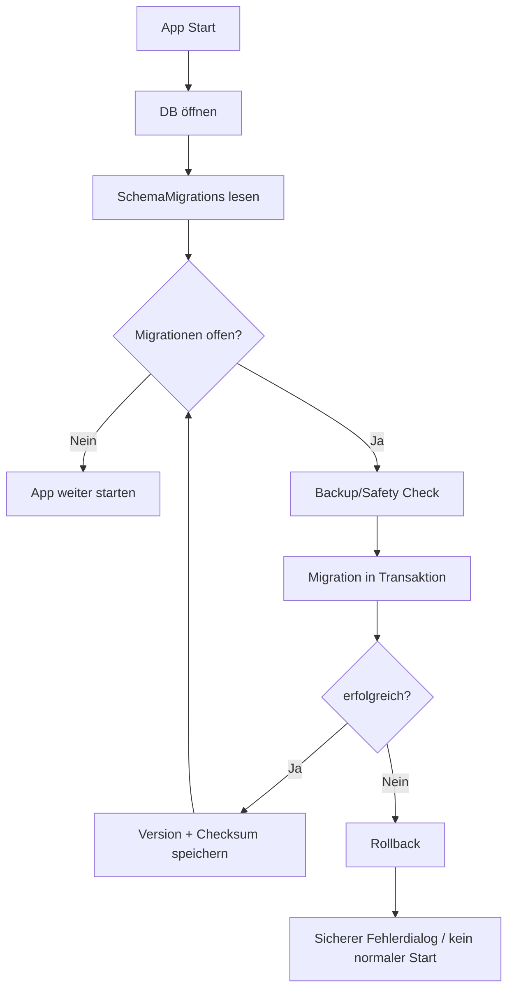

## 28.3 Migration Safety

Grundregeln:

- Reihenfolge unveränderlich,
- angewandte Migration nicht still editieren,
- Checksum dokumentieren,
- bei Fehler kein halb migrierter Normalbetrieb,
- wichtige Datenmigrationen mit repräsentativen Testdaten prüfen.

## 28.4 Downgrade

Down-Migrations sind nicht verpflichtend.

Wiederherstellung erfolgt über:

- Backup vor Upgrade,
- ältere App-Version + kompatiblen Backupstand.

---

# 29. Repository Architecture

## 29.1 Schreib-Repositories

Repositories kapseln Persistenz, nicht Business Logic.

Beispiele:

```text
IResourceRepository
ISkillRepository
ILearningPathRepository
IGoalRepository
IEvidenceRepository
IKnowledgeArtifactRepository
```

## 29.2 Kein Generic Repository Dogma

Ein `IRepository<T>` würde fachlich unterschiedliche Anforderungen verschleiern.

Beispiel Resource braucht:

- FindByNormalizedUrl,
- relations,
- archive queries.

LearningPath braucht:

- Tree Loading,
- Descendants,
- Node Ordering.

Daher spezialisierte Ports.

## 29.3 Query Services

Für Read-Performance:

```text
IResourceQueryService
IDashboardQueryService
ISearchQueryService
ILearningPathQueryService
```

Diese dürfen direkt optimierte SQL-Projektionen liefern.

---

# 30. Transaktionsgrenzen

Transaktion erforderlich bei fachlich atomaren Operationen.

Beispiele:

### Resource + Tags/Skills

```text
Update Resource
+ ResourceSkill changes
+ ResourceTag changes
+ ActivityLog
= eine Transaktion
```

### Path Node Move

```text
Parent ändern
+ Geschwister sortieren
+ Activity
= eine Transaktion
```

### Skill Assessment

```text
Assessment insert
+ CurrentLevel Snapshot
+ ActivityLog
= eine Transaktion
```

### Import

Ein Import-Batch sollte entweder:

- vollständig atomar,
- oder in klar dokumentierten, wiederaufnehmbaren Teilbatches

sein. V1 bevorzugt bei üblichen Datenmengen eine Transaktion nach bestätigtem Preview.

---

# 31. Connection Management

## 31.1 Keine globale Shared Connection

Connection pro Operation / Unit of Work.

Gründe:

- saubere Transaktionsgrenzen,
- bessere Thread-Sicherheit,
- weniger versteckter globaler Zustand.

## 31.2 Foreign Keys

Bei jeder Connection:

```sql
PRAGMA foreign_keys = ON;
```

## 31.3 WAL

WAL wird wahrscheinlich aktiviert, aber nur nach Backup-/Restore-Test.

Vorteile:

- bessere Read/Write-Koexistenz,
- robuste lokale Nutzung.

Risiko:

- falsches File-Copy-Backup kann inkonsistent sein.

Daher SQLite Backup API statt blindem Kopieren.

---

# 32. Backup Architecture

## 32.1 Backup ist Architekturfeature, kein UI-Extra

Backup gehört zum Reliability Design.

## 32.2 Komponenten

```text
BackupApplicationService
    │
    ├── IDatabaseBackupProvider
    ├── ISettingsExportProvider
    ├── IHashService
    └── IBackupPackageWriter
```

## 32.3 Backup-Paket

```text
SASD-LearningManager-Backup-YYYYMMDD-HHMMSS.zip
├── manifest.json
├── database/
│   └── learning-manager.db
└── settings/
    └── exportable-settings.json
```

Externe Dateien werden V1 nicht automatisch eingesammelt.

## 32.4 Sequenz

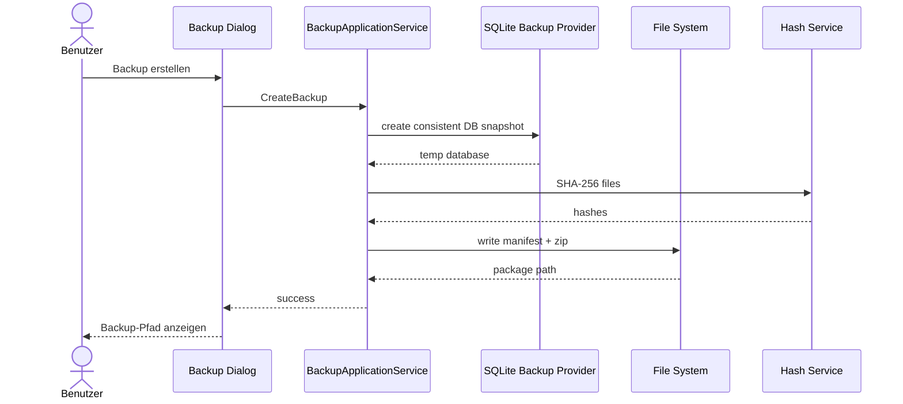

---

# 33. Restore Architecture

## 33.1 Restore ist defensiv

Restore ersetzt die lokale Source of Truth und wird deshalb wie eine privilegierte Wartungsoperation behandelt.

## 33.2 Validierungspipeline

```text
ZIP öffnen
→ Pfade prüfen
→ Manifest prüfen
→ Version prüfen
→ Hashes prüfen
→ DB temporär öffnen
→ integrity_check
→ aktuelle DB sichern
→ produktive DB schließen
→ ersetzen
→ Migrationen
→ Neustart
```

## 33.3 Zip-Slip-Schutz

Jeder Archive Entry:

1. Zielpfad kombinieren,
2. mit `Path.GetFullPath` normalisieren,
3. prüfen, dass Ziel unter Restore-Temp-Root liegt.

## 33.4 Restore Isolation

Restore arbeitet zuerst in Temp-Verzeichnissen.

Produktive Datei wird erst nach erfolgreicher Validierung ersetzt.

---

# 34. Import-/Exportarchitektur

## 34.1 Export Ports

```text
IDataExportService
IKnowledgeMarkdownExporter
ICsvExporter
```

## 34.2 Export ist versioniert

Vollständiger strukturierter Export:

```json
{
  "format": "sasd-learning-manager-export",
  "version": 1,
  "exportedAtUtc": "...",
  "data": {}
}
```

## 34.3 Import Staging

Import schreibt nicht direkt während des Parsings.

Pipeline:

```text
File
 → Parser
 → Staging Model
 → Validation
 → Duplicate Analysis
 → Preview
 → Confirm
 → Application Import Use Case
 → Transaction
```

## 34.4 Warum Staging?

Verhindert:

- halb importierte Daten,
- Überraschungs-Merges,
- direkte Persistenz von ungültigem Fremdformat.

---

# 35. Local File Architecture

## 35.1 V1: Referenzen, kein Vault

Lokale Dateien werden mit `LocalPath` referenziert.

Vorteil:

- kein doppelter Speicher,
- einfache Implementierung,
- Benutzer behält bestehende Ordnerstruktur.

Nachteile:

- Pfade können brechen,
- Backups enthalten Dateien nicht automatisch.

## 35.2 Missing File

Missing File ist ein Zustand der Referenz, kein Grund, Resource/Evidence zu löschen.

UI:

```text
Datei nicht gefunden
[Pfad ändern]
[Ordner öffnen]
```

## 35.3 Future Managed Attachments

Später optional:

```text
attachments/
  <id>/
    original.pdf
```

mit:

- Hash,
- Kopier-/Move-Policy,
- Backupintegration.

Diese Erweiterung bleibt außerhalb V1.

---

# 36. Runtime Architecture

## 36.1 Prozessmodell

V1 besteht aus **einem Desktop-Prozess**.

```text
SASD.LearningManager.WinForms.exe
```

Keine:

- Sidecar Services,
- Background Daemons,
- lokale Webserver,
- Container,
- Worker Processes.

## 36.2 Threads

- UI Thread für WinForms,
- Async I/O für HTTP,
- Background Task für längere Backup/Import-Operationen,
- SQLite Connections nicht threadübergreifend teilen.

## 36.3 `async void`

Nur für WinForms Event Handler.

Alle anderen Async APIs:

```text
Task
Task<T>
```

## 36.4 Cancellation

Lange Vorgänge erhalten `CancellationToken`, wenn Abbruch fachlich sicher möglich ist.

Beispiele:

- Metadata Fetch,
- Export,
- Import vor Commit,
- Suche.

Restore/DB-Migration darf nach kritischem Commit-Punkt nicht beliebig abgebrochen werden.

---

# 37. Startup Architecture

## 37.1 Composition Root

`Program.cs` ist der Composition Root.

Er:

- erstellt Host,
- lädt Config,
- konfiguriert Logging,
- registriert Ports/Adapter,
- führt Migrationen aus,
- resolved MainForm.

## 37.2 Startup Flow

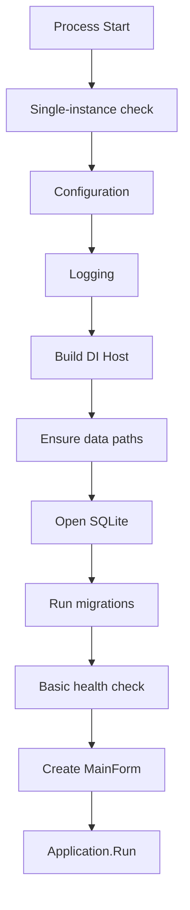

## 37.3 Failure Mode

Wenn DB/Migration nicht sicher abgeschlossen werden kann:

- Main UI startet nicht normal,
- Recovery Dialog,
- Log,
- Restore-/Datenpfadoption.

---

# 38. Shutdown Architecture

Ablauf:

1. neue Benutzeraktionen blockieren,
2. laufende abbrechbare Tasks canceln,
3. nicht abbrechbare kritische Operationen kontrolliert abschließen,
4. UI Settings speichern,
5. Host stoppen,
6. Logs flushen,
7. Prozess beenden.

Keine lang laufenden Background Jobs sollen den Shutdown unbemerkt blockieren.

---

# 39. Deployment Architecture

## 39.1 Deployment Unit

Eine Windows Desktop-Anwendung.

```text
Application binaries
.NET Runtime (framework-dependent oder self-contained)
Third-party notices
License
```

Benutzerdaten separat:

```text
%LOCALAPPDATA%\SASD\LearningManager\
```

## 39.2 Datenverzeichnis

```text
%LOCALAPPDATA%\SASD\LearningManager\
├── data/
│   └── learning-manager.db
├── logs/
├── backups/
└── settings.json
```

## 39.3 Installationsordner

Enthält **keine produktive DB**.

## 39.4 Packaging

Pilotphase:

```text
dotnet publish
```

Vor 1.0:

- MSIX oder
- WiX

per ADR evaluieren.

---

# 40. Update Architecture

## 40.1 Trennung App-Version / Schema-Version

```text
ApplicationVersion
SchemaVersion
BackupFormatVersion
ExportFormatVersion
```

werden getrennt geführt.

## 40.2 Upgrade

```text
neue Anwendung
→ Start
→ Safety Backup
→ Migration
→ normaler Betrieb
```

## 40.3 Kein stilles Downgrade

Eine ältere App darf nicht ungeprüft eine neuere DB öffnen.

Beim Start:

- minimale/maximale unterstützte Schema-Version prüfen.

---

# 41. Configuration Architecture

## 41.1 Settings

Nichtfachliche Settings als JSON.

Beispiele:

- Window Bounds,
- Last View,
- Backup Directory,
- UI Language,
- Advanced Log Level.

## 41.2 Fachliche Daten

Nicht in Settings:

- Skills,
- Goals,
- Resource-Status,
- Progress,
- Evidence.

Diese gehören in SQLite.

## 41.3 Secrets

V1 hat keine externen Secrets.

Spätere Secrets dürfen nicht einfach im Settings-JSON liegen. Windows Credential Manager oder DPAPI-basierte Lösung wäre dann separat zu evaluieren.

---


# 42. Security Architecture

## 42.1 Schutzobjekte

Wesentliche Assets:

1. persönliche Lernziele,
2. Skill-/Kompetenzbewertungen,
3. Lernhistorie,
4. Notizen und Knowledge Artifacts,
5. Evidence,
6. lokale Dateireferenzen,
7. SQLite-Datenbank,
8. Backups,
9. Logs.

Die Anwendung verarbeitet keine Zahlungsdaten und in V1 keine Provider-Passwörter, enthält aber dennoch personenbezogene und beruflich sensible Informationen.

## 42.2 Threat Model – Hauptbedrohungen

| Bedrohung | Beispiel | Kontrolle |
|---|---|---|
| SQL Injection | manipulierter Titel/Import | ausschließlich parameterisierte SQL-Queries |
| Path Traversal | manipuliertes Backup ZIP | canonical path check / Zip-Slip-Schutz |
| Active Content | `javascript:` URL | Scheme Allowlist |
| unsicheres HTML | fremde Website-Metadaten | Plain Text / Sanitizing |
| DB-Korruption | Crash/fehlerhafte Migration | Transaktionen, Backup, integrity_check |
| untrusted Import | manipuliertes JSON | Staging, Schema Validation |
| Datenabfluss | ungefragte Telemetrie | keine externe Telemetrie V1 |
| Secret Leakage | spätere Tokens in Logs | kein Secret Logging, separates Secret Design |
| ungewollter Datenverlust | Hard Delete | Archive first, Confirmation |
| Doppelinstanz | parallele lokale Writes | Single Instance / Mutex |

## 42.3 Trust-Boundary-Design

### Interner Vertrauensbereich

- eigene Assemblies,
- validierte DB,
- lokale Settings nach Parsing,
- durch Application Layer validierte Domainzustände.

### Nicht vertrauenswürdig

- URLs,
- HTML/Metadaten,
- Importdateien,
- Backup-Dateien unbekannter Herkunft,
- lokale Dateiinhalte außerhalb App,
- spätere API-Antworten externer Provider.

## 42.4 URL-Security

Zulässige Schemes für V1 Resource-Öffnung:

```text
http
https
```

`file:` wird nicht als normale Web-URL behandelt; lokale Dateien laufen über kontrollierten `LocalPath`.

Nicht zulässig:

```text
javascript:
data:
shell:
powershell:
```

ohne separate zukünftige Securityentscheidung.

## 42.5 HTTP-Sicherheitsgrenzen

Metadata Service:

- Timeout,
- Redirect-Limit,
- Response Size Limit,
- keine JS Engine,
- keine Authentifizierungsdaten,
- kein Cookie-Sharing mit Browser,
- keine automatische Dateiinstallation.

## 42.6 Import-Security

`System.Text.Json` ohne gefährliche dynamische Typauflösung.

Importdaten werden:

- strukturell geprüft,
- fachlich geprüft,
- erst nach Preview persistiert.

## 42.7 SQLite

- parametrisierte Statements,
- Foreign Keys aktiviert,
- keine SQL-Fragmente aus Benutzerfiltern,
- DB-Datei nicht über Netzwerkshare als V1-Standard.

## 42.8 Backups

Backups enthalten persönliche Daten.

V1:

- nicht automatisch verschlüsselt,
- kein Cloud Upload,
- klare Benutzerhinweise.

Spätere verschlüsselte Backups erfordern ein eigenes Key-Management-Design.

---

# 43. Privacy Architecture

## 43.1 Privacy by Default

Kernprinzip:

> Was lokal funktionieren kann, bleibt lokal.

## 43.2 Netzwerkkontakte V1

Nur wenn vom Benutzer ausgelöst:

- externe URL im Browser öffnen,
- optional Metadaten für konkrete URL abrufen,
- Update/Repository-Links außerhalb Kernlogik.

## 43.3 Keine Pflichttelemetrie

V1 sendet keine Nutzungsstatistiken.

## 43.4 Logs

Logs enthalten technische Informationen, aber nicht standardmäßig:

- kompletten Notizinhalt,
- komplette Knowledge Artifacts,
- vollständige persönliche Begründungen,
- Query Tokens mit potenziell sensiblen Daten.

## 43.5 Future AI

Vor externer AI-Integration wird ein Data-Flow-Review benötigt:

```text
Welche Daten?
→ welcher Provider?
→ zu welchem Zweck?
→ wie lange gespeichert?
→ welche Opt-in-Entscheidung?
→ kann lokal gearbeitet werden?
```

---

# 44. Observability und Diagnose

## 44.1 Ziel

Für eine Desktop-App bedeutet Observability nicht Prometheus/Grafana, sondern **lokal nachvollziehbare Diagnose**.

## 44.2 Logging

`Microsoft.Extensions.Logging` als Abstraktion.

Lokaler Rolling File Sink.

Logfelder soweit sinnvoll:

```text
Timestamp
Level
EventId
Operation
EntityType
EntityId (falls unkritisch)
CorrelationId
Message
Exception
```

## 44.3 Fehler-ID

Unerwartete UI-Fehler erhalten:

```text
ERR-YYYYMMDD-XXXX
```

UI:

> Die Änderung konnte nicht gespeichert werden. Fehler-ID: ERR-...

Log enthält dieselbe ID.

## 44.4 Diagnostics View

Darf anzeigen:

- App Version,
- Schema Version,
- DB Path,
- DB Size,
- letzter Backupzeitpunkt,
- letzter Integrity Check,
- Log Directory.

Keine Knowledge-/Skill-Inhalte.

## 44.5 Activity Log vs. Technical Log

**ActivityLog**
- fachliche Historie,
- Benutzer kann sie sehen.

**Technical Log**
- Diagnose,
- für Support/Entwicklung.

Die beiden Konzepte bleiben getrennt.

---

# 45. Fehler- und Ausfallverhalten

## 45.1 Fehlerklassen

### Validation Error

erwartbar, feldnah.

### Domain Conflict

z. B. Zyklus im Path.

### Persistence Failure

DB Busy, I/O, Constraint.

### External Failure

URL Timeout, HTTP Fehler.

### Fatal Startup Failure

Schema/Migration/DB nicht sicher nutzbar.

## 45.2 Designregel

Externe Fehler degradieren **nur die betroffene Komfortfunktion**.

Beispiel:

```text
Metadatenabruf fehlgeschlagen
→ Resource kann trotzdem gespeichert werden.
```

## 45.3 DB Failure

Wenn Speichern fehlschlägt:

- Transaktion Rollback,
- UI zeigt nicht fälschlich „gespeichert“,
- Dirty State kann erhalten bleiben,
- Fehler wird geloggt.

## 45.4 Corruption

Keine automatische „Reparatur“, die weitere Schäden verursachen kann.

Optionen:

- Diagnose,
- Backup Restore,
- Datenordner öffnen,
- Supportlog.

---

# 46. Performance Architecture

## 46.1 Zielbestände

Architektur soll problemlos mit typischer persönlicher Langzeitnutzung arbeiten:

```text
5.000+ Resources
1.500+ Skills
500+ Topics
500 Learning Paths
10.000 Path Nodes
20.000+ Relations
10.000 Knowledge Artifacts
```

## 46.2 Strategien

- Indizes,
- SQL-Projektionen,
- Pagination,
- keine vollständigen Objektgraphen,
- kleine Lookup Caches,
- Dashboard Aggregatqueries,
- FTS5 nur bei Bedarf.

## 46.3 UI-Grids

DataGridView bekommt paginierte `ListItemDto`.

Nicht:

```text
SELECT * FROM Resources
→ 5000 Domain Entities
→ In-Memory Filter
```

sondern:

```text
Filter
→ SELECT projection
→ LIMIT/OFFSET
→ DTO
```

## 46.4 N+1-Vermeidung

Listenquery lädt Providername per JOIN/Projection.

Nicht jede Row triggert eigenes Repository-Lookup.

## 46.5 Baum

Ein einzelner Learning Path wird komplett oder abschnittsweise geladen; bei erwarteten Größen ist kompletter Node-Baum vertretbar.

---

# 47. Caching Architecture

V1 verwendet absichtlich wenig Cache.

Geeignet:

- Provider Lookup,
- Tags,
- kleine statische/selten geänderte Lookups.

Nicht geeignet:

- kompletter Resourcebestand,
- Skill-Historie,
- Path-Bäume über lange Zeit.

Cache-Invalidierung muss einfacher sein als der Performancegewinn.

---

# 48. Concurrency und Single-User-Architektur

## 48.1 Single User

Es gibt keine fachliche Multiuser-Konfliktlösung.

## 48.2 Prozesskonkurrenz

Named Mutex verhindert versehentliche zweite Instanz.

## 48.3 Hintergrundoperationen

Jede Operation erhält eigene DB Connection.

Transaktionen bleiben kurz.

## 48.4 SQLite Busy

Begrenzter Busy Timeout / kurzer Retry.

Nach Timeout:

- Operation fehlschlägt kontrolliert,
- kein unendliches Warten.

---

# 49. Accessibility Architecture

Accessibility ist kein rein optischer Nachtrag.

## 49.1 WinForms Controls

- `AccessibleName`,
- `AccessibleDescription`,
- logische TabOrder.

## 49.2 Status

Status immer:

- Text,
- optional Symbol,
- optional Farbe.

Farbe allein ist unzulässig.

## 49.3 DPI

UI verwendet standardfähige Skalierung und wird bei:

- 100 %
- 125 %
- 150 %
- 200 %

getestet.

## 49.4 Keyboard

Globale Shortcuts und vollständige Standardnavigation.

## 49.5 Path Tree

Tree-Funktionen müssen auch ohne Drag & Drop nutzbar sein.

---

# 50. Dependency Architecture

## 50.1 Prinzip

Abhängigkeit muss mehr Nutzen als langfristige Kosten erzeugen.

## 50.2 Kernabhängigkeiten

Voraussichtlich:

- .NET 8 BCL,
- `Microsoft.Data.Sqlite`,
- `Microsoft.Extensions.Hosting`,
- `Microsoft.Extensions.DependencyInjection`,
- `Microsoft.Extensions.Configuration`,
- `Microsoft.Extensions.Logging`,
- xUnit.

## 50.3 Optional

Logging File Provider / CSV Helper / Markdown Renderer nur nach Evaluierung.

## 50.4 Nicht als Pflicht vorgesehen

- EF Core,
- Dapper,
- MediatR,
- AutoMapper,
- Autofac,
- Reactive Extensions,
- Electron,
- WebView2,
- Serilog als zwingende Architekturkomponente.

Einzelne davon können später begründet eingesetzt werden; das Architekturmodell hängt nicht von ihnen ab.

## 50.5 Dependency Review

Vor Aufnahme:

- Lizenz,
- Security,
- Wartungsaktivität,
- Transitive Dependencies,
- Updatefrequenz,
- API-Stabilität,
- Ersetzbarkeit.

---

# 51. Build- und CI-Architektur

## 51.1 Reproduzierbare Toolchain

```powershell
dotnet restore .\SASD.LearningManager.sln
dotnet build .\SASD.LearningManager.sln -c Release --no-restore
dotnet test .\SASD.LearningManager.sln -c Release --no-build
```

## 51.2 CI Pipeline

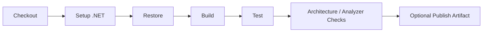

## 51.3 Qualitätsziel

- Release Build: 0 Errors,
- Ziel: 0 Warnings,
- Nullable aktiviert,
- Tests grün.

## 51.4 Architektur in CI

Architecture Tests verhindern schleichende Dependency-Verletzungen.

---

# 52. Testarchitektur

## 52.1 Testebenen

```text
Domain Unit Tests
Application Use-Case Tests
Infrastructure Integration Tests
Architecture Tests
UI Smoke / Manual UX Tests
```

## 52.2 Domain

Testet pure fachliche Regeln ohne DB.

## 52.3 Application

Verwendet Fakes/Test Doubles für Ports.

Testet:

- Orchestrierung,
- Conflict Handling,
- Statusübergänge,
- Traceability.

## 52.4 Infrastructure

Temporäre echte SQLite DB.

Testet:

- SQL,
- Schema,
- Migration,
- FK,
- Backup,
- Restore,
- Query Performance.

## 52.5 Architecture Tests

Beispielregeln:

```text
Domain must not reference WinForms
Domain must not reference Infrastructure
Application must not reference WinForms
Infrastructure must not reference WinForms
```

## 52.6 UI

UI enthält möglichst wenig Logik, daher reichen für V1:

- Presenter-/Presentation Tests,
- manuelle Smoke Tests,
- DPI-/Keyboard-/Accessibility-Checkliste.

---

# 53. Requirement Traceability

Architektur und Tests sollen Requirement IDs referenzieren.

Beispiele:

| Requirement | Architekturmechanismus |
|---|---|
| REQ-F-RES-002 | Canonical Resource + Join Tables |
| REQ-F-PATH-007 | `LearningPathNodeResource` |
| REQ-F-SKILL-012 | getrennte Resource-/Assessment-Aggregate |
| REQ-F-CAP-003 | `ResourceStatus.Inbox` |
| REQ-F-IO-001 | Backup Architecture |
| REQ-F-IO-002 | Restore Pipeline |
| REQ-Q-PERF-003 | Local SQLite + optional network |
| REQ-SEC-PRIV-001 | kein Cloudzwang |
| REQ-SEC-003 | keine Provider Credentials |

Tests dürfen Traits nutzen:

```csharp
[Trait("Requirement", "REQ-F-SKILL-012")]
```

---

# 54. Architekturentscheidungen – Übersicht

| ADR | Entscheidung | Status |
|---|---|---|
| ADR-001 | WinForms als V1 UI | Proposed |
| ADR-002 | SQLite als lokale Persistenz | Proposed |
| ADR-003 | explizites SQL + spezialisierte Repositories | Proposed |
| ADR-004 | geschichteter modularer Monolith | Proposed |
| ADR-005 | Canonical Resource | Proposed |
| ADR-006 | Completion / Mastery / Retention getrennt | Proposed |
| ADR-007 | Markdown als Knowledge-Source-Format | Proposed |
| ADR-008 | Archive over Delete | Proposed |
| ADR-009 | AI außerhalb V1 Core | Proposed |
| ADR-010 | versionierte SQL-Migrationen | Proposed |
| ADR-011 | persistierte fachliche Enums als TEXT | Proposed |
| ADR-012 | SQLite WAL + konsistente Backup API | Proposed |
| ADR-013 | GUIDs als fachliche IDs | Proposed |
| ADR-014 | no embedded browser for provider content | Proposed |
| ADR-015 | Topic und Skill bleiben getrennte Konzepte | Proposed |

---

# 55. Architekturentscheidungen – Begründung und Trade-offs

## ADR-001 – WinForms

**Kontext:** V1 ist eine Windows-Desktop-Anwendung.

**Alternativen:**
- WinForms,
- WPF,
- Avalonia,
- Web UI.

**Entscheidung:** WinForms.

**Gründe:**
- überschaubare Desktop-UI,
- reife Plattform,
- schnelle Entwicklung,
- gute .NET-Integration,
- kein Webdeployment erforderlich.

**Trade-off:**
- modernes Styling und komplexe visuelle Graphen sind weniger komfortabel als bei Web/WPF.

**Mitigation:**
- klare Standardcontrols,
- Roadmap zunächst TreeView,
- visuelle Graphansicht später separat.

## ADR-002 – SQLite

**Alternativen:**
- SQLite,
- JSON,
- SQL Server Express,
- PostgreSQL,
- LiteDB.

**Entscheidung:** SQLite.

**Gründe:**
- relationales Modell,
- kein Server,
- FK/Transaktionen,
- sehr gutes Backup,
- langfristig bewährt.

**Trade-off:**
- Multiuser/Cloudsync später nicht automatisch gelöst.

## ADR-003 – explizites SQL

**Alternativen:**
- EF Core,
- Dapper,
- raw `Microsoft.Data.Sqlite`.

**Entscheidung:** explizites SQL über spezialisierte Repository-/Query-Adapter.

**Gründe:**
- Transparenz,
- kleine Dependency-Landschaft,
- gute Lern-/Wartbarkeit,
- kontrollierbare Queries.

**Risiko:**
- mehr Mapping-Code.

**Mitigation:**
- klare Mapper/Query Utilities,
- Integrationstests.

## ADR-004 – modularer Monolith

**Alternativen:**
- Monolith ohne Grenzen,
- modularer Monolith,
- Microservices.

**Entscheidung:** modularer Monolith.

**Gründe:**
- ein Benutzer,
- eine DB,
- ein Deployment,
- klare Module ohne operative Verteilung.

## ADR-005 – Canonical Resource

**Entscheidung:** Ressource einmal speichern, beliebig referenzieren.

**Architekturfolge:**
- stabile IDs,
- Join Tables,
- zentrale Resource Ownership.

## ADR-006 – Completion/Mastery/Retention

**Entscheidung:** drei getrennte Zustandsmodelle.

**Architekturfolge:**
- Resource Progress,
- SkillAssessment,
- Skill Review/Recency.

## ADR-007 – Markdown

**Entscheidung:** Markdown-kompatibler Text als Source Format für Knowledge.

**Trade-off:**
- kein Rich-Text-Komfort als Kern.

**Vorteil:**
- Offenheit und Exportierbarkeit.

## ADR-008 – Archive over Delete

**Entscheidung:** Soft Archive ist Standard.

**Grund:** Lernhistorie ist langfristiges Asset.

## ADR-009 – kein AI im Core

**Entscheidung:** AI nur später als optionaler Port/Adapter.

**Grund:** Datenschutz, Determinismus, Funktionsfähigkeit ohne Dienst.

## ADR-010 – SQL-Migrationen

**Entscheidung:** nummerierte, versionierte Migrationen mit Checksum.

## ADR-011 – Enum TEXT

**Entscheidung:** fachliche Statuswerte lesbar als TEXT speichern.

## ADR-012 – WAL

**Entscheidungsvorschlag:** WAL nutzen, sofern Backup-/Restore-Test erfolgreich.

## ADR-013 – GUID

**Entscheidung:** GUID für Entities.

**Grund:** stabile Exporte/Imports und keine zentrale Sequence-Abhängigkeit.

## ADR-014 – kein eingebetteter Browser

**Entscheidung:** Providerinhalte im Standardbrowser öffnen.

**Grund:** kleinere Angriffsfläche und weniger Session-/DRM-Komplexität.

## ADR-015 – Topic vs Skill

**Entscheidung:** Topic und Skill bleiben getrennt.

**Grund:** Themenklassifikation und bewertbare Fähigkeit sind fachlich verschieden.

---


# 56. Erweiterungsarchitektur

## 56.1 Grundsatz

Erweiterbarkeit bedeutet nicht, heute bereits alle späteren Systeme einzubauen. Die Architektur schafft **Ports und stabile Domain-Grenzen**, ohne ungenutzte Frameworks vorzuinstallieren.

## 56.2 Provider-Integrationen

Späterer Port:

```csharp
public interface IProviderIntegration
{
    string ProviderKey { get; }

    Task<ProviderMetadataResult> TryGetMetadataAsync(
        Uri uri,
        CancellationToken cancellationToken);

    Task<ProviderProgressResult?> TryGetProgressAsync(
        ProviderResourceReference reference,
        CancellationToken cancellationToken);
}
```

V1 implementiert diesen Port nicht zwingend.

Regel:

- konkrete Providerklassen liegen Infrastructure/Integrations,
- Domain kennt nur Resource und Providerdaten,
- Credentials werden separat und sicher behandelt.

## 56.3 AI

Späterer Port:

```csharp
public interface ILearningAssistant
{
    Task<IReadOnlyList<TagSuggestion>> SuggestTagsAsync(...);
    Task<IReadOnlyList<SkillSuggestion>> SuggestSkillsAsync(...);
    Task<ResourceSummarySuggestion> SummarizeAsync(...);
}
```

AI-Ergebnis ist immer:

```text
Suggestion
→ Accept / Reject
```

nicht:

```text
Autonomous Update
```

## 56.4 Browser Extension

Die Browser Extension wäre ein **separater Client**, nicht Teil der WinForms Assembly.

Mögliche spätere Integrationswege:

- Custom URI Scheme,
- Named Pipes,
- abgesicherter localhost IPC Endpoint,
- Clipboard-/Import-Datei.

Vor Umsetzung werden Security und Lifecycle separat spezifiziert.

## 56.5 Cloud Sync

Cloud Sync ist keine einfache Infrastruktur-Erweiterung, sondern verändert das Konsistenzmodell.

Erforderlich wären:

- Benutzeridentität,
- Authentisierung,
- Sync-Versionen,
- Konflikterkennung,
- Merge-Strategien,
- Offline-Konflikte,
- Secret Management,
- Privacy.

Daher kein „vorbereiteter halber Sync“ in V1.

## 56.6 Teamfunktionen

Teamfunktionen verändern Ownership und Autorisierung. Sie werden nicht durch einfache `UserId`-Spalten vorweggenommen.

Wenn später benötigt, erfolgt eigene Architekturphase.

---

# 57. Architecture Fitness Functions

Bestimmte Architekturregeln sollen automatisierbar überprüft werden.

## FF-01 – Layer Dependency

Build/Test schlägt fehl, wenn Domain auf WinForms/Infrastructure referenziert.

## FF-02 – SQL Location

Review/Analyzer-Konvention: SQL gehört nur in Infrastructure Persistence/Queries/Migrations.

## FF-03 – No UI Business Rules

Kritische Regeln müssen Domain/Application Tests besitzen.

## FF-04 – Completion/Mastery Separation

Automatisierter Test:

```text
Complete Resource
→ SkillAssessment count unverändert
→ CurrentLevel unverändert
```

## FF-05 – Canonical Resource

Automatisierter Test:

```text
same Resource linked to two PathNodes
→ one Resource row
→ two join rows
```

## FF-06 – Backup Restore

CI oder regelmäßiger Integrationstest:

```text
seed
→ backup
→ mutate
→ restore
→ compare
```

## FF-07 – Migration

Alle Migrationen müssen aus leerer DB und von mindestens unterstützter Vorversion durchlaufen.

---

# 58. Architekturverifikation

## 58.1 Code Review

Reviewcheckliste:

- liegt die Änderung im richtigen Modul?
- wurde die Dependency-Richtung eingehalten?
- wurden Domainregeln in Application/UI dupliziert?
- braucht die Änderung eine Migration?
- braucht sie Backup-/Export-Anpassung?
- verändert sie Security-/Privacy-Datenfluss?
- existieren Tests?

## 58.2 CI

CI verifiziert:

- Restore,
- Build,
- Unit Tests,
- Integration Tests,
- Architecture Tests,
- Analyzer.

## 58.3 Release Review

Vor Release Candidate:

- Migrationstest,
- Backup-/Restore-Test,
- Security-Smoke,
- Datenintegritätsprüfung,
- DPI-/Accessibility-Check,
- Performance-Test,
- Requirement-Traceability-Review.

## 58.4 Architektur-Drift

Wenn die Implementierung bewusst von diesem Dokument abweicht:

1. ADR oder Architekturänderung dokumentieren,
2. Dokument aktualisieren,
3. betroffene Tests anpassen,
4. nicht still „Code ist Wahrheit“ werden lassen.

---

# 59. Risiken und technische Schulden

| ID | Risiko / Schuld | Auswirkung | Maßnahme | Zeitpunkt |
|---|---|---|---|---|
| ARCH-R-001 | WinForms-Logik wächst in Forms | schlechte Testbarkeit | Presenter/Application-Grenze | permanent |
| ARCH-R-002 | viele Join Tables | Query-Komplexität | spezialisierte Query Services | ab M3 |
| ARCH-R-003 | TreeView reicht langfristig optisch nicht | UX | Graph View erst nach V1 | V2 |
| ARCH-R-004 | Raw SQL erzeugt Boilerplate | Entwicklungsaufwand | Mapper/Utilities, nicht ORM reflexartig | laufend |
| ARCH-R-005 | WAL Backup falsch implementiert | Datenverlust | Backup API + Tests | M7 |
| ARCH-R-006 | zu viele Statuswerte | UX-Verwirrung | kontextbezogene Auswahl | UI Review |
| ARCH-R-007 | Topic/Skill zu aufwendig | Verwaltungsfriktion | Pilotmetriken | Pilot |
| ARCH-R-008 | LocalPath bricht | fehlende Datei | Missing-File-State | V1 |
| ARCH-R-009 | FTS später schwer nachzurüsten | Search | IDs/Textfelder sauber halten | V1.x |
| ARCH-R-010 | ActivityLog wächst | DB-Größe | Indizes/Retention evaluieren | später |
| ARCH-R-011 | Exportformat driftet | Lock-in | versionieren | V1.x |
| ARCH-R-012 | Provideradapter koppeln sich an Core | Wartung | Ports + Adapterreview | V2 |
| ARCH-R-013 | AI-Vorschläge werden als Wahrheit interpretiert | Fachfehler | Suggestion Workflow | V2 |
| ARCH-R-014 | zu frühe Abstraktionen | Overengineering | „Rule of three“ / pragmatisch | permanent |

---

# 60. Bewusst akzeptierte technische Vereinfachungen

## 60.1 Kein Unit of Work Framework

Transaktionsgrenzen werden explizit in Infrastructure/Application gehandhabt.

## 60.2 Kein Event Bus

ActivityLog wird direkt geschrieben. Domain Events können später bei echtem Bedarf ergänzt werden.

## 60.3 Kein Full Audit Trail

ActivityLog ist persönliche Historie, keine forensisch manipulationssichere Auditlösung.

## 60.4 Keine DB-Verschlüsselung V1

Schutz über Windows Benutzerkontext und ggf. Laufwerksverschlüsselung.

Falls DB-Verschlüsselung später gefordert wird, muss Key Management korrekt entworfen werden.

## 60.5 Kein Attachment Vault

V1 referenziert Dateien.

## 60.6 Kein automatisches Link-Monitoring

Keine permanente Hintergrundaktivität.

Diese Vereinfachungen reduzieren V1-Komplexität, ohne den Produktkern zu beschädigen.

---

# 61. Milestone-Zuordnung zur Architektur

## Milestone 0 – Architektur-Baseline

Implementiert:

- Assemblies,
- DI,
- Host,
- Logging,
- SQLite Connection Factory,
- Migration Runner,
- MainForm,
- Architekturtests.

Architekturevidenz:

- Dependency Matrix Test,
- Restore/Build/Test,
- initiale ADRs.

## Milestone 1 – Resource-Modul

Validiert besonders:

- Canonical Resource,
- Providerneutralität,
- Repository-/Query-Trennung.

## Milestone 2 – Capture

Validiert:

- optionales Netzwerk,
- URL Trust Boundary,
- Dublettenfluss.

## Milestone 3 – Goals/Skills

Validiert:

- Topic/Skill-Trennung,
- append-oriented Assessment,
- Gap.

## Milestone 4 – Learning Paths

Validiert:

- Tree + Relation Graph,
- Zyklusvermeidung,
- Path Progress.

## Milestone 5 – Knowledge/Evidence

Validiert:

- Knowledge Source Format,
- Evidence Ownership,
- Completion/Mastery Separation.

## Milestone 6 – Dashboard/Search

Validiert:

- Read Models,
- Query Performance,
- Pagination.

## Milestone 7 – Reliability

Validiert:

- Backup,
- Restore,
- Security,
- Migration,
- Performance,
- Deployment.

---

# 62. Architektur-Definition of Done

Architekturarbeit eines Features ist fertig, wenn:

- Modulownership geklärt,
- Abhängigkeiten geprüft,
- fachliche Invarianten lokalisiert,
- Datenmodelländerung dokumentiert,
- Migration vorhanden falls nötig,
- Fehlerpfad definiert,
- Security-/Privacy-Auswirkung geprüft,
- Backup/Export-Auswirkung geprüft,
- Tests auf passender Ebene vorhanden,
- relevante ADR-/Architekturänderung dokumentiert.

---

# 63. Datenfluss-Matrix

| Use Case | UI | Application | Domain | Infrastructure | Extern |
|---|---|---|---|---|---|
| Resource erfassen | QuickCapture | CaptureResource | Resource rules | SQLite | optional Metadata |
| Resource starten | ResourceDetail | ChangeStatus | transition rules | SQLite | nein |
| Path Node verschieben | PathView | MoveNode | hierarchy policy | SQLite transaction | nein |
| Skill bewerten | SkillAssessmentForm | AssessSkill | level rules | SQLite | nein |
| Evidence anlegen | EvidenceForm | CreateEvidence | Evidence rules | SQLite/File ref | optional file |
| globale Suche | SearchView | SearchQuery | – | SQL/FTS | nein |
| Backup | Maintenance | BackupService | – | SQLite/File | nein |
| Restore | Recovery/Maintenance | RestoreService | – | File/SQLite | nein |
| URL öffnen | ResourceDetail | OpenResourceLink | scheme validation | OS shell adapter | Browser |
| Metadata | Capture | Metadata Use Case | – | HTTP adapter | Website |

---

# 64. Sensible Datenflüsse

## 64.1 Skill Assessment

```text
UI-Eingabe
→ Application Validation
→ Skill Assessment Domain
→ SQLite
```

Kein Netzwerk.

## 64.2 Knowledge

```text
Markdown Text
→ Application
→ SQLite
→ Export optional auf Benutzeraktion
```

Kein automatischer Cloudfluss.

## 64.3 URL Metadata

```text
Resource URL
→ HttpClient
→ externe Website
→ begrenzte Metadaten
→ Benutzer prüft
→ Resource Update
```

Dieser Flow überschreitet die Trust Boundary.

## 64.4 Backup

```text
SQLite
→ lokales Snapshot
→ ZIP + Manifest + Hash
→ Benutzergewählter lokaler Pfad
```

Keine automatische externe Übertragung.

---

# 65. Architektur und Datenschutz bei Support

Wenn ein Benutzer einen Fehler meldet, sollen Supportinformationen getrennt bereitgestellt werden:

**technisch sinnvoll:**

- App Version,
- Schema Version,
- Error ID,
- Logauszug.

**nicht automatisch:**

- komplette DB,
- Knowledge,
- Skillbewertungen,
- Backups.

Die Architektur soll Diagnose ermöglichen, ohne standardmäßig persönliche Inhalte teilen zu müssen.

---

# 66. Architektur für Datenportabilität

## 66.1 Prinzip

Die SQLite DB ist Implementierungsdetail; Export ist Integrationsvertrag.

## 66.2 Exportebenen

### Vollständiger strukturierter Export

JSON:

- IDs,
- Entities,
- Relationships,
- Formatversion.

### Tabellenorientierter Export

CSV:

- Resources,
- Skills,
- Reports.

### Wissensexport

Markdown:

- einzelne oder mehrere Knowledge Artifacts.

## 66.3 Stabilität

Exportversion wird unabhängig von DB-Schema versioniert.

Damit kann DB intern verändert werden, ohne jedes Exportformat identisch zu machen.

---

# 67. Architektur für spätere Reports

Reports werden als Read Models/Exports betrachtet, nicht als Domain-Entities.

Beispiele:

- „Was habe ich dieses Quartal gelernt?“
- „Skills unter Zielniveau“
- „Abgeschlossene Ressourcen ohne neue Skillbewertung“
- „Lange nicht verwendete Skills“.

Report Engine darf später Queries kombinieren, ohne fachliche Source of Truth zu duplizieren.

---

# 68. Architektur für Retention

V1.x bleibt bewusst einfach.

```text
Skill
- LastUsedAtUtc
- NextReviewAtUtc
```

`RetentionStatus` kann als Projection berechnet werden.

Kein eigenes komplexes Scheduling Aggregate, solange kein echtes Spaced-Repetition-Feature existiert.

Wenn später Anki/RemNote integriert wird:

- Learning Manager exportiert/integriert,
- Scheduling verbleibt möglichst im Spezialtool.

---

# 69. Architektur für History

## 69.1 Skill

SkillAssessment ist echte fachliche Historie.

## 69.2 Activity

ActivityLog ist generische Verlaufshilfe.

## 69.3 Resource

StartedAt/CompletedAt bleiben direkte Lifecycle-Felder plus Activity.

## 69.4 Keine vollständige Versionierung aller Datensätze

V1 speichert nicht jede Textänderung an Resource Description als Revision.

Wenn später wichtig:

- gezielte Revisionstabelle für bestimmte Objekte,
- nicht globales Event Sourcing.

---

# 70. Architecture Decision Process

Eine neue ADR ist erforderlich, wenn eine Entscheidung:

- mehrere Module betrifft,
- schwer reversibel ist,
- Datenmigration verursacht,
- externe Dependency langfristig bindet,
- Security-/Privacy-Modell verändert,
- Deployment verändert,
- Domain-Grenzen verändert.

MADR-artige Struktur:

```text
Status
Context
Decision
Options
Consequences
Links
```

Kleine lokale Codeentscheidungen benötigen keine ADR.

---

# 71. Änderungsmanagement des Architekturdokuments

Änderungen werden versioniert.

| Version | Datum | Änderung | Grund |
|---|---|---|---|
| 0.1 | 27.08.2026 | Erstfassung | Ableitung aus Pflichtenheft |

Vor 1.0 soll nach größeren Milestones geprüft werden:

- stimmt Systemkontext noch?
- stimmen Dependency-Regeln?
- neue Adapter?
- neue sensible Datenflüsse?
- neue technische Schulden?
- ADRs aktuell?

---

# 72. Architektur-Freigabekriterien

Vor Beginn der langfristigen Implementierung sollen mindestens folgende Entscheidungen akzeptiert sein:

- [ ] modularer Monolith
- [ ] vier Hauptassemblies
- [ ] WinForms
- [ ] SQLite
- [ ] Canonical Resource
- [ ] Topic vs Skill
- [ ] Skill Assessment History
- [ ] Learning Path = Tree + Relations
- [ ] Completion/Mastery/Retention getrennt
- [ ] explicit SQL / repositories
- [ ] Migration Strategy
- [ ] Archive over Delete
- [ ] Backup/Restore
- [ ] local-first / no provider credentials
- [ ] Markdown Knowledge
- [ ] Tests / Architecture Fitness Functions

---

# 73. Zusammenfassendes Architektururteil

Die Architektur des SASD Learning Manager ist bewusst **konservativ in der Technik und ambitioniert im Domain Model**.

Das ist beabsichtigt.

Der fachliche Wert liegt in:

- Lernzielen,
- Skills und Skill Gaps,
- providerunabhängigen Learning Paths,
- kanonischen Resources,
- Evidence,
- Knowledge,
- langfristiger Lernhistorie.

Diese Komplexität rechtfertigt ein sauberes relationales Domain Model, aber **keine verteilte technische Architektur**.

Daraus folgt die Kernentscheidung:

> **Ein modularer .NET-8-WinForms-Monolith mit klarer Domain-/Application-Trennung und SQLite ist für V1 die angemessene Architektur.**

Er bietet:

- minimale Betriebsabhängigkeiten,
- lokale Datenhoheit,
- nachvollziehbare Persistenz,
- gute Testbarkeit,
- überschaubaren Build,
- starke Datenintegrität,
- ausreichend Erweiterungsspielraum.

Die Architektur vermeidet bewusst:

- Microservices,
- Message Broker,
- Cloudzwang,
- eingebettete Browserkomplexität,
- schwergewichtige ORM-/CQRS-Infrastruktur,
- AI als Kernabhängigkeit.

So bleibt der Learning Manager auch nach Jahren verständlich und wartbar.

---

# Anhang A – C4-artige Systemübersicht

## A.1 Kontext

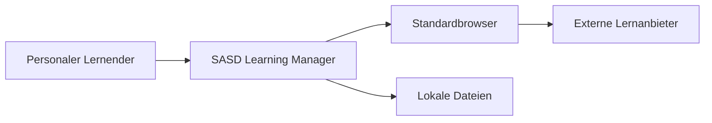

## A.2 Container / Deployment Units

Da es sich um einen Desktop-Monolith handelt, entsprechen die „Container“ hier logischen Laufzeitbestandteilen:

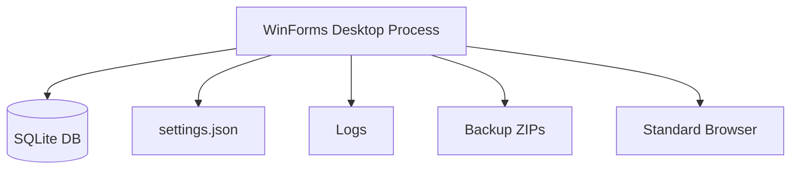

## A.3 Components

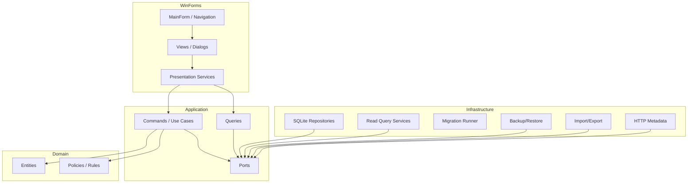

---

# Anhang B – Dependency Rule als ASCII

```text
                    ┌─────────────────────┐
                    │      WinForms       │
                    │ UI / Presentation   │
                    └─────────┬───────────┘
                              │
                              ▼
                    ┌─────────────────────┐
                    │     Application     │
                    │ Use Cases / Ports   │
                    └─────────┬───────────┘
                              │
                              ▼
                    ┌─────────────────────┐
                    │       Domain        │
                    │ Rules / Entities    │
                    └─────────────────────┘

      ┌────────────────────────────────────────────┐
      │               Infrastructure               │
      │ SQLite / Files / HTTP / Backup / Logging   │
      └──────────────┬─────────────────────────────┘
                     │ implements Application Ports
                     └──────────────────────────────►
```

---

# Anhang C – Zentrale Invarianten

1. Eine Resource kann mehrfach referenziert werden, aber bleibt kanonisch.
2. Resource Completion setzt keinen Skill-Level.
3. Skill Assessment wird historisch ergänzt.
4. Learning Path Tree darf keine Zyklen besitzen.
5. Path Relation und Path Hierarchy sind unterschiedliche Konzepte.
6. Optional Nodes reduzieren nicht den Required-Core-Abschluss.
7. Archivierung erhält Historie.
8. Externe Fehler dürfen lokalen Core nicht unnötig blockieren.
9. Import schreibt erst nach Validierung/Preview.
10. Restore ersetzt Produktivdaten erst nach vollständiger Backupprüfung.
11. SQL ist parameterisiert.
12. Domain hängt weder von SQLite noch WinForms ab.

---

# Anhang D – Empfohlene ADR-Dateien

```text
docs/decisions/
├── ADR-001-winforms-ui.md
├── ADR-002-sqlite-persistence.md
├── ADR-003-explicit-sql-repositories.md
├── ADR-004-modular-layered-monolith.md
├── ADR-005-canonical-resource.md
├── ADR-006-completion-mastery-retention.md
├── ADR-007-markdown-knowledge.md
├── ADR-008-archive-over-delete.md
├── ADR-009-no-ai-v1-core.md
├── ADR-010-schema-migrations.md
├── ADR-011-enum-text-persistence.md
├── ADR-012-sqlite-wal-backup.md
├── ADR-013-guid-identifiers.md
├── ADR-014-no-embedded-provider-browser.md
└── ADR-015-topic-vs-skill.md
```

---

# Anhang E – Architektur-Review-Checkliste

## Systemgrenzen

- [ ] externe Provider außerhalb des Core
- [ ] Browser als externer Client behandelt
- [ ] Netzwerk optional
- [ ] lokale Source of Truth eindeutig

## Schichten

- [ ] Domain ohne technische Dependencies
- [ ] Application ohne UI/SQL
- [ ] Infrastructure als Adapter
- [ ] WinForms dünn

## Daten

- [ ] FK aktiv
- [ ] Constraints
- [ ] Migrationen
- [ ] Archive-Regeln
- [ ] Backup/Restore
- [ ] Exportversionierung

## Security

- [ ] URI Allowlist
- [ ] SQL parameterisiert
- [ ] Import Staging
- [ ] Zip-Slip-Schutz
- [ ] keine Secrets in Logs
- [ ] keine ungefragte Telemetrie

## Qualität

- [ ] Requirement Traceability
- [ ] Domain Tests
- [ ] Integration Tests
- [ ] Architecture Tests
- [ ] DPI/Accessibility
- [ ] Performance Testdaten

---

# Anhang F – Quellen und Bezugsdokumente

## Projektartefakte

- `SASD-Learning-Manager-Vorlagen-Funktionsanalyse.md`
- `SASD-Learning-Manager-Lastenheft.md`
- `SASD-Learning-Manager-Pflichtenheft-WinForms.md`

## SASD Development Standard

- <https://github.com/Robin-Goerlach/SASD-Development-Standard>
- <https://github.com/Robin-Goerlach/SASD-Development-Standard/blob/main/templates/documents/ARCHITECTURE-TEMPLATE.md>
- <https://github.com/Robin-Goerlach/SASD-Development-Standard/blob/main/templates/documents/SASD-DESKTOP-COMPLIANCE-TEMPLATE.md>
- <https://github.com/Robin-Goerlach/SASD-Development-Standard/blob/main/templates/documents/SASD-DOTNET-COMPLIANCE-TEMPLATE.md>

---

**Ende des Architekturdokuments**
